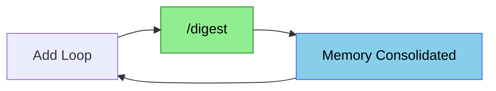

<!-- Last synced: 2025-12-03 (CONCEPT.en.md references added) -->
English | [日本語](README.md)

# EpisodicRAG Plugin - Glossary & Reference

> **Project Overview & Installation**: See [Main README](../README.md)

A collection of terminology definitions used in the EpisodicRAG plugin.

## Table of Contents

**Core Concepts**
- [Basic Concepts](#basic-concepts)
- [Memory Structure](#memory-structure)
- [8-Layer Hierarchy](#8-layer-hierarchy)

**Operations Guide**
- [Processes & Operations](#processes--operations)
- [File Naming Conventions](#file-naming-conventions)
- [Commands & Skills](#commands--skills)

**Configuration & Development**
- [Configuration Files](#configuration-files)
- [Developer Reference](#developer-reference)
- [Language Policy](#language-policy)
- [Related Documents](#related-documents)

---

## Basic Concepts

### plugin_root
**Definition**: The plugin installation directory

- The directory where `.claude-plugin/config.json` exists
- Skills and scripts operate relative to this directory
- Example: `C:\Users\anyth\.claude\plugins\marketplaces\Plugins-Weave\EpisodicRAG`

### Path Format Differences

EpisodicRAG uses different paths depending on the environment:

| Environment | Path Format | Example |
|-------------|-------------|---------|
| **Development** | Source code directly | `plugins-weave/EpisodicRAG/` |
| **Marketplace** | `~/.claude/plugins/marketplaces/` | `~/.claude/plugins/marketplaces/Plugins-Weave/EpisodicRAG/` |
| **Direct Plugin Install** | `~/.claude/plugins/` | `~/.claude/plugins/EpisodicRAG-Plugin@Plugins-Weave/` |

**Important**: Configuration files (config.json) and data should always be placed in the installation directory, not in the development source code directory.

### base_dir
**Definition**: The base directory for data placement

- **Location**: `base_dir` field in `config.json`
- **Format**: Relative or absolute path (tilde expansion supported)
- **Examples**:
  - `.` (within plugin, default)
  - `subdir` (subdirectory within plugin)
  - `~/DEV/production/EpisodicRAG` (external path, requires `trusted_external_paths` permission)
  - `C:/Users/anyth/DEV/data` (Windows absolute path, requires `trusted_external_paths` permission)

Path resolution:
- Relative path: `plugin_root + base_dir` → actual data base directory
- Absolute path: Used as-is (must be within `trusted_external_paths`)

### trusted_external_paths
**Definition**: List of absolute paths allowed for access outside plugin_root

- **Location**: `trusted_external_paths` field in `config.json`
- **Format**: Array of absolute paths (tilde expansion supported)
- **Default**: `[]` (empty array, only plugin_root allowed)
- **Example**: `["~/DEV/production", "C:/Data/EpisodicRAG"]`

**Security**:
- Default is empty array (most secure)
- External paths require explicit permission
- Relative paths not allowed (absolute only)
- Recommended to add `config.json` to `.gitignore` for Git publishing

**Usage Example (External Data Directory)**:
```json
{
  "base_dir": "~/DEV/production/EpisodicRAG",
  "trusted_external_paths": ["~/DEV/production"],
  "paths": {
    "loops_dir": "data/Loops",
    "digests_dir": "data/Digests",
    "essences_dir": "data/Essences"
  }
}
```

### paths
**Definition**: Placement locations for each data directory

- **Location**: `paths` section in `config.json`
- **Format**: Relative paths from base_dir
- **Includes**: `loops_dir`, `digests_dir`, `essences_dir`, `identity_file_path`

Path resolution: `base_dir + paths.loops_dir` → actual Loop directory

### Loop
**Definition**: A text file recording an entire conversation session with AI

- **Format**: `L[sequence_number]_[title].txt`
- **Example**: `L00001_CognitiveArchitecture.txt`
- **Regex**: `^L[0-9]+_[\p{L}\p{N}ー・\w]+\.txt$`
- **Location**: `{loops_dir}/`

Loops are the smallest unit of the EpisodicRAG system and serve as the foundation for all Digest generation.

### Digest
**Definition**: A hierarchical record that summarizes and integrates multiple Loops or lower-level Digests

Types of Digests:

| Type | Description |
|------|-------------|
| **Individual Digest** | Summary of a single Loop/Digest |
| **Overall Digest** | Integrated summary of multiple Loops/Digests |
| **Provisional Digest** | Temporary digest (pre-finalization storage) |
| **Regular Digest** | Official digest (finalized) |

### Essences
**Definition**: Meta-information directory storing GrandDigest and ShadowGrandDigest

- **Location**: `{essences_dir}/`
- **Contains**:
  - `GrandDigest.txt` - Finalized memory
  - `ShadowGrandDigest.txt` - Unfinalized memory

---

## Memory Structure

> 📖 Concept explanation: [CONCEPT.en.md - Three-Layer System](CONCEPT.en.md#three-layer-system)

### GrandDigest
**Definition**: JSON file storing finalized long-term memory

- **File**: `{essences_dir}/GrandDigest.txt`
- **Contents**: Latest finalized Digest for each hierarchy (Weekly to Centurial)
- **Update timing**: When a hierarchy is finalized with `/digest <type>`

> See [ARCHITECTURE.md](docs/dev/ARCHITECTURE.md#granddigesttxt) for detailed format

```json
{
  "metadata": { "last_updated": "...", "version": "1.0" },
  "major_digests": {
    "weekly": { "overall_digest": {...} },
    "monthly": { "overall_digest": {...} }
  }
}
```

### ShadowGrandDigest
**Definition**: JSON file storing unfinalized incremental digests

- **File**: `{essences_dir}/ShadowGrandDigest.txt`
- **Purpose**: Temporarily stores analysis results of new Loops, promoted to Regular after threshold is met
- **Update timing**: When new Loops are detected and analyzed with `/digest`

> See [ARCHITECTURE.md](docs/dev/ARCHITECTURE.md#shadowgranddigesttxt) for detailed format

```json
{
  "latest_digests": {
    "weekly": {
      "overall_digest": {
        "timestamp": "2025-07-01T12:00:00",
        "source_files": ["L00001.txt", "L00002.txt"],
        "digest_type": "<!-- PLACEHOLDER -->",
        "keywords": ["<!-- PLACEHOLDER -->", ...],
        "abstract": "<!-- PLACEHOLDER: abstract (max 2400 chars) -->",
        "impression": "<!-- PLACEHOLDER: impression (max 800 chars) -->"
      }
    }
  }
}
```

### Provisional Digest
**Definition**: Individual digest for next hierarchy (temporary file)

- **Location**: `{digests_dir}/{level_dir}/Provisional/`
- **Format**: `{prefix}{number}_Individual.txt`
- **Example**: `W0001_Individual.txt`
- **Lifespan**: Until RegularDigest finalization when `/digest <type>` is executed

### Regular Digest
**Definition**: Finalized official digest file

- **Location**: `{digests_dir}/{level_dir}/`
- **Format**: `{prefix}{number}_title.txt`
- **Example**: `W0001_CognitiveArchitecture.txt`

---

## 8-Layer Hierarchy

> 📖 Concept explanation: [CONCEPT.en.md - 8-Layer Structure](CONCEPT.en.md#8-layer-structure)

EpisodicRAG manages memory across 8 hierarchical layers (approximately 108 years):

| Layer | Prefix | Time Scale | Default Threshold | Cumulative Loops |
|-------|--------|-----------|------------------|-----------------|
| **Weekly** | W | ~1 week | 5 Loops | 5 |
| **Monthly** | M | ~1 month | 5 Weekly | 25 |
| **Quarterly** | Q | ~3 months | 3 Monthly | 75 |
| **Annual** | A | ~1 year | 4 Quarterly | 300 |
| **Triennial** | T | ~3 years | 3 Annual | 900 |
| **Decadal** | D | ~9 years | 3 Triennial | 2,700 |
| **Multi-decadal** | MD | ~27 years | 3 Decadal | 8,100 |
| **Centurial** | C | ~108 years | 4 Multi-decadal | 32,400 |

### Hierarchical Cascade

Process that automatically propagates to upper hierarchies when finalizing a Digest:

```text
Loop (5) → Weekly Digest
  ↓
Weekly (5) → Monthly Digest
  ↓
Monthly (3) → Quarterly Digest
  ↓
Quarterly (4) → Annual Digest
  ↓
Annual (3) → Triennial Digest
  ↓
Triennial (3) → Decadal Digest
  ↓
Decadal (3) → Multi-decadal Digest
  ↓
Multi-decadal (4) → Centurial Digest
```

---

## Processes & Operations

### Mottled Memory (まだらボケ)

> 📖 Concept explanation: [CONCEPT.en.md - The Patchy Memory Problem](CONCEPT.en.md#the-patchy-memory-problem)

**Definition**: A state where AI cannot remember the contents of Loops (fragmented memory)

#### The Essence of EpisodicRAG

1. **Adding Loop files** = Saving conversation records to files (physical storage)
2. **Running `/digest`** = Consolidating memory in AI (cognitive storage)
3. **Without `/digest`** = Files exist, but AI doesn't remember

#### Cases Where Mottled Memory Occurs

**Case 1: Neglecting unprocessed Loops (most common)**

```text
L00001 added → No `/digest` → L00002 added
                               ↑
                    At this point, AI doesn't remember L00001
                    (memory is mottled = fragmented)
```

**Countermeasure**: Run `/digest` each time you add a Loop

**Case 2: Error during `/digest` processing (technical issue)**

```text
/digest executed → Error occurred → In ShadowGrandDigest,
                                    source_files registered but
                                    digest is null (placeholder)
```

**Countermeasure**: Re-run `/digest` to complete analysis

### Memory Consolidation Cycle

> 📖 Concept explanation: [CONCEPT.en.md - Memory Consolidation Cycle](CONCEPT.en.md#memory-consolidation-cycle)

EpisodicRAG's most important principle is to **run `/digest` each time you add a Loop**.



**What to do:**
```text
L00001 added → /digest → L00002 added → /digest → ...
```

By following this principle, AI can remember all Loops.

**What NOT to do:**
```text
L00001 added → L00002 added → /digest
                 ↑
       At this point, AI doesn't remember L00001 (mottled memory)
```

### Threshold
**Definition**: Minimum number of files required to generate each hierarchy's Digest

- **Location**: `{plugin_root}/.claude-plugin/config.json`
- **Change method**: Interactively change with `@digest-config` skill

### Placeholder
**Definition**: An unanalyzed state where `digest: null` in ShadowGrandDigest

- **Cause**: Error during `/digest` processing, or analysis incomplete
- **Resolution**: Re-run `/digest` to complete analysis

---

## File Naming Conventions

### ID Digit Count

| Level | Prefix | Digits | Example |
|-------|--------|--------|---------|
| Loop | L | 5 | L00001 |
| Weekly | W | 4 | W0001 |
| Monthly | M | 4 | M0001 |
| Quarterly | Q | 3 | Q001 |
| Annual | A | 3 | A001 |
| Triennial | T | 2 | T01 |
| Decadal | D | 2 | D01 |
| Multi-Decadal | MD | 2 | MD01 |
| Centurial | C | 2 | C01 |

### Loop Files
```text
Format: L[sequence_number]_[title].txt
Number: 5-digit number (larger = newer)
Examples: L00001_InitialSession.txt
          L00186_CognitiveArchitecture.txt
```

### Provisional Files
```text
Format: {prefix}{number}_Individual.txt
Examples: W0001_Individual.txt
          M0001_Individual.txt
```

### Regular Files
```text
Format: {prefix}{number}_title.txt
Examples: W0001_CognitiveArchitecture.txt
          M0001_MonthlySummary.txt
```

---

## Commands & Skills

| Command/Skill | Description |
|---------------|-------------|
| `/digest` | Detect new Loops and analyze (mottled memory prevention) |
| `/digest <type>` | Finalize specific hierarchy (e.g., `/digest weekly`) |
| `@digest-auto` | System status diagnosis and recommended action presentation |
| `@digest-setup` | Initial setup (interactive) |
| `@digest-config` | Configuration changes (interactive) |

---

## Configuration Files

### config.json
**Location**: `{plugin_root}/.claude-plugin/config.json`

```json
{
  "base_dir": ".",
  "paths": {
    "loops_dir": "data/Loops",
    "digests_dir": "data/Digests",
    "essences_dir": "data/Essences",
    "identity_file_path": null
  },
  "levels": {
    "weekly_threshold": 5,
    "monthly_threshold": 5,
    "quarterly_threshold": 3,
    "annual_threshold": 4,
    "triennial_threshold": 3,
    "decadal_threshold": 3,
    "multi_decadal_threshold": 3,
    "centurial_threshold": 4
  },
  "trusted_external_paths": []
}
```

> **v4.0.0+**: `trusted_external_paths` is a whitelist for external path access. Explicit registration is required when using external paths (such as `identity_file_path`).

---

## Developer Reference

| Concept | File |
|---------|------|
| Implementation Guidelines | [_implementation-notes.md](skills/shared/_implementation-notes.md) |
| DigestConfig API | [API_REFERENCE.md](docs/dev/API_REFERENCE.md) |
| File Format Specifications | [ARCHITECTURE.md](docs/dev/ARCHITECTURE.md) |

---

## Terminology Index

| Term | Section |
|------|---------|
| base_dir | [Basic Concepts](#base_dir) |
| Cascade | [8-Layer Hierarchy](#hierarchical-cascade) |
| Digest | [Basic Concepts](#digest) |
| Essences | [Basic Concepts](#essences) |
| GrandDigest | [Memory Structure](#granddigest) |
| Loop | [Basic Concepts](#loop) |
| Mottled Memory | [Processes & Operations](#mottled-memory-まだらボケ) |
| paths | [Basic Concepts](#paths) |
| Placeholder | [Processes & Operations](#placeholder) |
| plugin_root | [Basic Concepts](#plugin_root) |
| Provisional Digest | [Memory Structure](#provisional-digest) |
| Regular Digest | [Memory Structure](#regular-digest) |
| ShadowGrandDigest | [Memory Structure](#shadowgranddigest) |
| Threshold | [Processes & Operations](#threshold) |

---

## Language Policy

Multilingual documentation policy for EpisodicRAG:

| Category | Language | Reason |
|----------|----------|--------|
| **All Documents** | Japanese (SSoT) | Primary source of information |
| **English Versions** | QUICKSTART, CHEATSHEET, README | Reduce onboarding barriers |
| **Developer Details** | Japanese only | AI-First - AI can understand/supplement Japanese |

**AI-First Documentation Principles**:
- AI agents (Claude Code, etc.) can directly understand natural language
- With search keywords, AI can understand and supplement Japanese documentation
- Dynamic AI translation is more efficient than maintaining full translations

---

## Related Documents

- [Main README](../README.md) - Project Overview
- [CONCEPT](CONCEPT.en.md) - Design Philosophy
- [AI Spec Hub](docs/README.md) - Command, Skill & Agent Specifications
- [QUICKSTART](docs/user/QUICKSTART.en.md) - 5-minute Tutorial
- [CHEATSHEET](docs/user/CHEATSHEET.en.md) - Quick Reference
- [GUIDE](docs/user/GUIDE.md) - User Guide

---
**EpisodicRAG** by Weave | [GitHub](https://github.com/Bizuayeu/Plugins-Weave)
