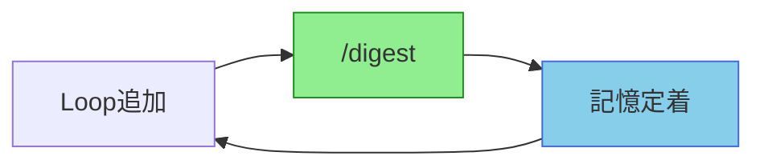

[English](README.en.md) | [日本語](README.md)

# EpisodicRAG Plugin - 用語集・リファレンス

> **プロジェクト概要・インストール**は [メインREADME](../README.md) を参照

EpisodicRAGプラグインで使用される専門用語の定義集です。

## 目次

- [基本概念](#基本概念)
- [記憶構造](#記憶構造)
- [8階層構造](#8階層構造)
- [プロセス・操作](#プロセス操作)
- [ファイル命名規則](#ファイル命名規則)
- [コマンド・スキル](#コマンドスキル)
- [設定ファイル](#設定ファイル)
- [開発者向けリファレンス](#開発者向けリファレンス)
- [関連ドキュメント](#関連ドキュメント)

---

## 基本概念

### plugin_root
**定義**: プラグインのインストール先ディレクトリ

- `.claude-plugin/config.json` が存在するディレクトリ
- スキルやスクリプトはこのディレクトリを基準に動作
- 例: `C:\Users\anyth\.claude\plugins\marketplaces\Plugins-Weave\EpisodicRAG`

### パス形式の違い

EpisodicRAGは環境によって異なるパスを使用します：

| 環境 | パス形式 | 例 |
|------|---------|-----|
| **開発環境** | ソースコード直接 | `plugins-weave/EpisodicRAG/` |
| **マーケットプレース** | `~/.claude/plugins/marketplaces/` | `~/.claude/plugins/marketplaces/Plugins-Weave/EpisodicRAG/` |
| **プラグイン直接インストール** | `~/.claude/plugins/` | `~/.claude/plugins/EpisodicRAG-Plugin@Plugins-Weave/` |

**重要**: 設定ファイル（config.json）やデータは常にインストール先に配置します。開発環境のソースコードディレクトリには配置しないでください。

### base_dir
**定義**: データ配置の基準ディレクトリ

- **設定場所**: `config.json` の `base_dir` フィールド
- **形式**: 相対パスまたは絶対パス（チルダ展開サポート）
- **例**:
  - `.`（プラグイン内、デフォルト）
  - `subdir`（プラグイン内のサブディレクトリ）
  - `~/DEV/production/EpisodicRAG`（外部パス、`trusted_external_paths`で許可が必要）
  - `C:/Users/anyth/DEV/data`（Windows絶対パス、`trusted_external_paths`で許可が必要）

パス解決:
- 相対パス: `plugin_root + base_dir` → 実際のデータ基準ディレクトリ
- 絶対パス: そのまま使用（`trusted_external_paths`内である必要あり）

### trusted_external_paths
**定義**: plugin_root外でアクセスを許可する絶対パスのリスト

- **設定場所**: `config.json` の `trusted_external_paths` フィールド
- **形式**: 絶対パスの配列（チルダ展開サポート）
- **デフォルト**: `[]`（空配列、plugin_root内のみ許可）
- **例**: `["~/DEV/production", "C:/Data/EpisodicRAG"]`

**セキュリティ**:
- デフォルトは空配列で最もセキュア
- 外部パスを使用する場合は明示的な許可が必要
- 相対パスは使用不可（絶対パスのみ）
- Git公開時は`config.json`を`.gitignore`に追加推奨

**使用例（外部データディレクトリ）**:
```json
{
  "base_dir": "~/DEV/production/EpisodicRAG",
  "trusted_external_paths": ["~/DEV/production"],
  "paths": {
    "loops_dir": "data/Loops",
    "digests_dir": "data/Digests",
    "essences_dir": "data/Essences"
  }
}
```

### paths
**定義**: 各データディレクトリの配置先

- **設定場所**: `config.json` の `paths` セクション
- **形式**: base_dir からの相対パス
- **含まれる設定**: `loops_dir`, `digests_dir`, `essences_dir`, `identity_file_path`

パス解決: `base_dir + paths.loops_dir` → 実際のLoopディレクトリ

### Loop
**定義**: AI との会話セッション全体を記録したテキストファイル

- **形式**: `L[連番]_[タイトル].txt`
- **例**: `L00001_認知アーキテクチャ論.txt`
- **正規表現**: `^L[0-9]+_[\p{L}\p{N}ー・\w]+\.txt$`
- **配置先**: `{loops_dir}/`

Loopは EpisodicRAG システムの最小単位であり、すべてのDigest生成の基礎データとなります。

### Digest
**定義**: 複数のLoopまたは下位Digestを要約・統合した階層的記録

Digestには以下の種類があります：

| 種類 | 説明 |
|------|------|
| **Individual Digest** | 単一Loop/Digestの要約 |
| **Overall Digest** | 複数Loop/Digestの統合要約 |
| **Provisional Digest** | 仮ダイジェスト（確定前の一時保存） |
| **Regular Digest** | 正式ダイジェスト（確定済み） |

### Essences
**定義**: GrandDigest と ShadowGrandDigest を格納するメタ情報ディレクトリ

- **配置先**: `{essences_dir}/`
- **含まれるファイル**:
  - `GrandDigest.txt` - 確定済み記憶
  - `ShadowGrandDigest.txt` - 未確定記憶

---

## 記憶構造

### GrandDigest
**定義**: 確定済みの長期記憶を格納するJSONファイル

- **ファイル**: `{essences_dir}/GrandDigest.txt`
- **内容**: 各階層（Weekly〜Centurial）の最新確定Digest
- **更新タイミング**: `/digest <type>` で階層を確定した時

> 詳細な形式は [ARCHITECTURE.md](docs/dev/ARCHITECTURE.md#granddigesttxt) を参照

```json
{
  "metadata": { "last_updated": "...", "version": "1.0" },
  "major_digests": {
    "weekly": { "overall_digest": {...} },
    "monthly": { "overall_digest": {...} }
  }
}
```

### ShadowGrandDigest
**定義**: 未確定の増分ダイジェストを格納するJSONファイル

- **ファイル**: `{essences_dir}/ShadowGrandDigest.txt`
- **用途**: 新しいLoopの分析結果を一時保存し、threshold達成後にRegularに昇格
- **更新タイミング**: `/digest` で新規Loopを検出・分析した時

> 詳細な形式は [ARCHITECTURE.md](docs/dev/ARCHITECTURE.md#shadowgranddigesttxt) を参照

```json
{
  "latest_digests": {
    "weekly": {
      "overall_digest": {
        "source_files": ["L00001.txt", "L00002.txt"],
        "keywords": ["<!-- PLACEHOLDER -->", ...],
        "abstract": "<!-- PLACEHOLDER: ... -->"
      }
    }
  }
}
```

### Provisional Digest
**定義**: 次階層用の個別ダイジェスト（一時ファイル）

- **配置先**: `{digests_dir}/{level_dir}/Provisional/`
- **形式**: `{prefix}{番号}_Individual.txt`
- **例**: `W0001_Individual.txt`
- **生存期間**: `/digest <type>` 実行時のRegularDigest確定まで

### Regular Digest
**定義**: 確定済みの正式ダイジェストファイル

- **配置先**: `{digests_dir}/{level_dir}/`
- **形式**: `{日付}_{prefix}{番号}_タイトル.txt`
- **例**: `2025-07-01_W0001_認知アーキテクチャ.txt`

---

## 8階層構造

EpisodicRAGは8つの階層で記憶を管理します（約108年分）：

| 階層 | プレフィックス | 時間スケール | デフォルト閾値 | 累積Loop数 |
|------|---------------|-------------|---------------|-----------|
| **Weekly** | W | ~1週間 | 5 Loops | 5 |
| **Monthly** | M | ~1ヶ月 | 5 Weekly | 25 |
| **Quarterly** | Q | ~3ヶ月 | 3 Monthly | 75 |
| **Annual** | A | ~1年 | 4 Quarterly | 300 |
| **Triennial** | T | ~3年 | 3 Annual | 900 |
| **Decadal** | D | ~9年 | 3 Triennial | 2,700 |
| **Multi-decadal** | MD | ~27年 | 3 Decadal | 8,100 |
| **Centurial** | C | ~108年 | 4 Multi-decadal | 32,400 |

### 階層的カスケード

Digest確定時に上位階層へ自動的に伝播する処理です：

```text
Loop (5個) → Weekly Digest
  ↓
Weekly (5個) → Monthly Digest
  ↓
Monthly (3個) → Quarterly Digest
  ↓
Quarterly (4個) → Annual Digest
  ↓
Annual (3個) → Triennial Digest
  ↓
Triennial (3個) → Decadal Digest
  ↓
Decadal (3個) → Multi-decadal Digest
  ↓
Multi-decadal (4個) → Centurial Digest
```

---

## プロセス・操作

### まだらボケ
**定義**: AIがLoopの内容を記憶できていない（虫食い記憶）状態

#### EpisodicRAGの本質

1. **Loopファイル追加** = 会話記録をファイルに保存（物理的保存）
2. **`/digest` 実行** = AIに記憶を定着させる（認知的保存）
3. **`/digest` なし** = ファイルはあるが、AIは覚えていない

#### まだらボケが発生するケース

**ケース1: 未処理Loopの放置（最も一般的）**

```text
L00001追加 → `/digest`せず → L00002追加
                              ↑
                    この時点でAIはL00001の内容を覚えていない
                    （記憶がまだら＝虫食い状態）
```

**対策**: Loopを追加したら都度`/digest`で記憶定着

**ケース2: `/digest`処理中のエラー（技術的問題）**

```text
/digest 実行 → エラー発生 → ShadowGrandDigestに
                           source_filesは登録されたが
                           digestがnull（プレースホルダー）
```

**対策**: `/digest`を再実行して分析を完了

### 記憶定着サイクル

EpisodicRAGの最も重要な原則は、**Loopを追加したら都度 `/digest` を実行する**ことです。



**やるべきこと:**
```text
L00001追加 → /digest → L00002追加 → /digest → ...
```

**やってはいけないこと:**
```text
L00001追加 → L00002追加 → /digest
                 ↑
       この時点でL00001の内容をAIは覚えていない（まだらボケ）
```

この原則を守ることで、AIは全てのLoopを記憶できます。

### Threshold（閾値）
**定義**: 各階層のDigest生成に必要な最小ファイル数

- **設定場所**: `{plugin_root}/.claude-plugin/config.json`
- **変更方法**: `@digest-config` スキルで対話的に変更

### プレースホルダー
**定義**: ShadowGrandDigest内で`digest: null`となっている未分析状態

- **原因**: `/digest`処理中のエラー、または分析が未完了
- **解決方法**: `/digest`を再実行して分析を完了

---

## ファイル命名規則

### ID桁数一覧

| レベル | プレフィックス | 桁数 | 例 |
|--------|----------------|------|-----|
| Loop | L | 5 | L00001 |
| Weekly | W | 4 | W0001 |
| Monthly | M | 4 | M0001 |
| Quarterly | Q | 3 | Q001 |
| Annual | A | 3 | A001 |
| Triennial | T | 2 | T01 |
| Decadal | D | 2 | D01 |
| Multi-Decadal | MD | 2 | MD01 |
| Centurial | C | 2 | C01 |

### Loopファイル
```text
形式: L[連番]_[タイトル].txt
連番: 5桁の数字（大きいほど新しい）
例:   L00001_初回セッション.txt
      L00186_認知アーキテクチャ論.txt
```

### Provisionalファイル
```text
形式: {prefix}{番号}_Individual.txt
例:   W0001_Individual.txt
      M0001_Individual.txt
```

### Regularファイル
```text
形式: {日付}_{prefix}{番号}_タイトル.txt
例:   2025-07-01_W0001_認知アーキテクチャ.txt
      2025-08-15_M001_月次まとめ.txt
```

---

## コマンド・スキル

| コマンド/スキル | 説明 |
|----------------|------|
| `/digest` | 新規Loop検出と分析（まだらボケ予防） |
| `/digest <type>` | 特定階層の確定（例: `/digest weekly`） |
| `@digest-auto` | システム状態診断と推奨アクション提示 |
| `@digest-setup` | 初期セットアップ（対話的） |
| `@digest-config` | 設定変更（対話的） |

---

## 設定ファイル

### config.json
**配置**: `{plugin_root}/.claude-plugin/config.json`

```json
{
  "base_dir": ".",
  "paths": {
    "loops_dir": "data/Loops",
    "digests_dir": "data/Digests",
    "essences_dir": "data/Essences",
    "identity_file_path": null
  },
  "levels": {
    "weekly_threshold": 5,
    "monthly_threshold": 5,
    "quarterly_threshold": 3,
    "annual_threshold": 4,
    "triennial_threshold": 3,
    "decadal_threshold": 3,
    "multi_decadal_threshold": 3,
    "centurial_threshold": 4
  }
}
```

---

## 開発者向けリファレンス

| 概念 | ファイル |
|------|---------|
| 実装ガイドライン | [_implementation-notes.md](skills/shared/_implementation-notes.md) |
| DigestConfig API | [API_REFERENCE.md](docs/dev/API_REFERENCE.md) |
| ファイル形式仕様 | [ARCHITECTURE.md](docs/dev/ARCHITECTURE.md) |

---

## 用語インデックス

| 用語 | セクション |
|------|----------|
| base_dir | [基本概念](#base_dir) |
| Cascade | [8階層構造](#階層的カスケード) |
| Digest | [基本概念](#digest) |
| Essences | [基本概念](#essences) |
| GrandDigest | [記憶構造](#granddigest) |
| Loop | [基本概念](#loop) |
| paths | [基本概念](#paths) |
| Placeholder | [プロセス・操作](#プレースホルダー) |
| plugin_root | [基本概念](#plugin_root) |
| Provisional Digest | [記憶構造](#provisional-digest) |
| Regular Digest | [記憶構造](#regular-digest) |
| ShadowGrandDigest | [記憶構造](#shadowgranddigest) |
| Threshold | [プロセス・操作](#threshold閾値) |
| まだらボケ | [プロセス・操作](#まだらボケ) |

---

## 関連ドキュメント

- [メインREADME](../README.md) - プロジェクト概要
- [AI Spec Hub](docs/README.md) - コマンド・スキル・エージェント仕様
- [QUICKSTART](docs/user/QUICKSTART.md) - 5分チュートリアル
- [GUIDE](docs/user/GUIDE.md) - ユーザーガイド

---
**EpisodicRAG** by Weave | [GitHub](https://github.com/Bizuayeu/Plugins-Weave)
