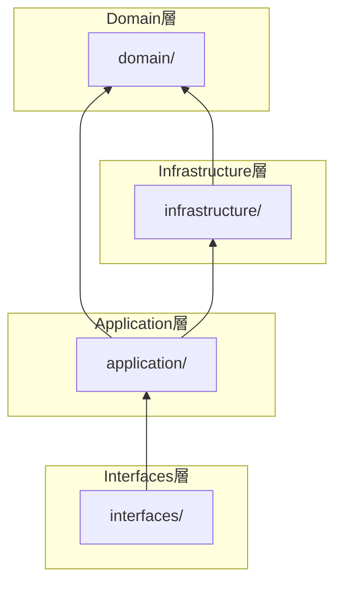
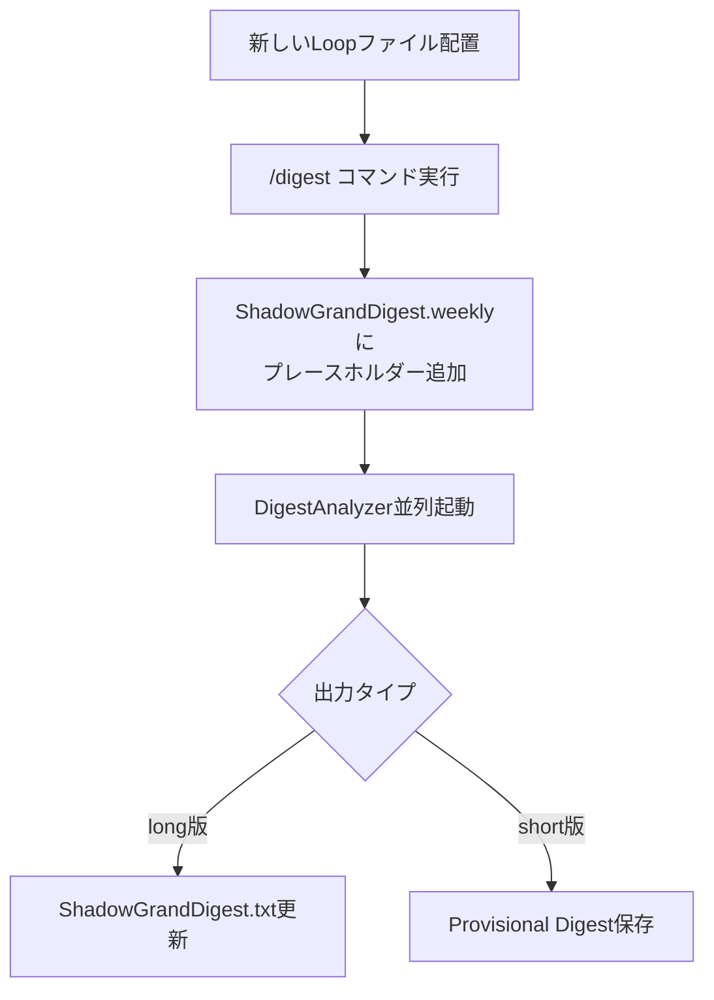
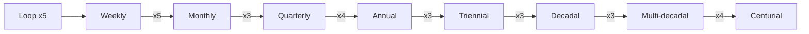
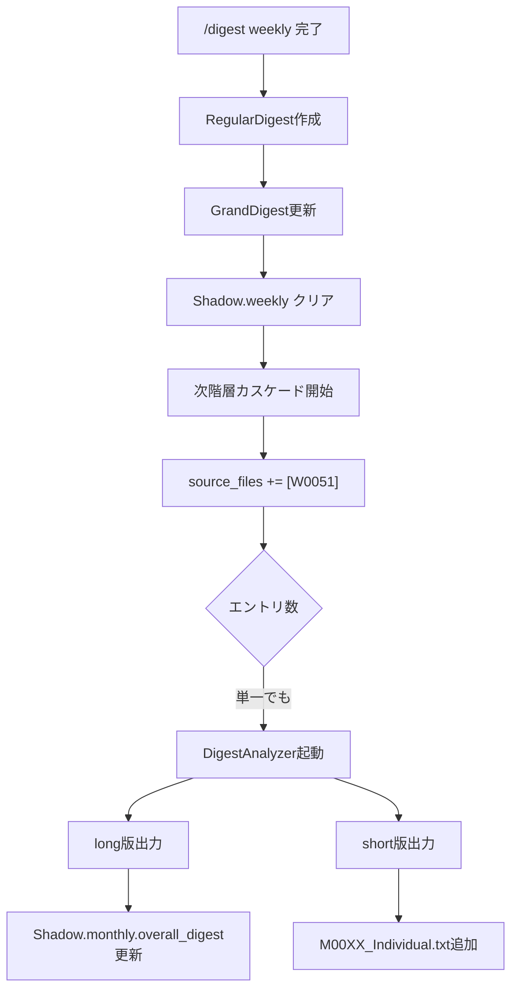

[EpisodicRAG](../../README.md) > [Docs](../README.md) > ARCHITECTURE

# Architecture - EpisodicRAG Plugin

このドキュメントでは、EpisodicRAGプラグインの技術仕様とアーキテクチャについて説明します。

> **対応バージョン**: EpisodicRAG Plugin（[version.py](../../scripts/domain/version.py) 参照）/ ファイルフォーマット 1.0

---

## 目次

1. [ディレクトリ構成](#ディレクトリ構成)
2. [Clean Architecture](#clean-architecture)
3. [主要API一覧](#主要api一覧)
4. [データフロー](#データフロー)
5. [パス解決の仕組み](#パス解決の仕組み)
6. [技術仕様](#技術仕様)
7. [テスト](#テスト)
8. [セキュリティとプライバシー](#セキュリティとプライバシー)
9. [パフォーマンス](#パフォーマンス)
10. [拡張性](#拡張性)
11. [次のステップ](#次のステップ)

---

## ディレクトリ構成

### Plugin構造（完全自己完結）

```text
~/.claude/plugins/EpisodicRAG-Plugin@Plugins-Weave/
├── .claude-plugin/
│   ├── CLAUDE.md                        # AIエージェント向け指示
│   ├── config.json                      # 設定ファイル（@digest-setupで生成）
│   ├── config.template.json             # 設定テンプレート
│   ├── last_digest_times.template.json  # Digest時刻テンプレート
│   ├── GrandDigest.template.txt         # GrandDigest初期化テンプレート
│   ├── ShadowGrandDigest.template.txt   # Shadow初期化テンプレート
│   └── plugin.json                      # Plugin メタデータ
├── agents/
│   └── digest-analyzer.md               # DigestAnalyzerエージェント
├── skills/
│   ├── digest-auto/SKILL.md             # システム状態確認スキル
│   ├── digest-setup/SKILL.md            # 初期セットアップスキル
│   ├── digest-config/SKILL.md           # 設定変更スキル
│   └── shared/                          # 共通コンポーネント
│       └── _implementation-notes.md     # 実装ノート
├── commands/
│   └── digest.md                        # /digest コマンド
├── scripts/                             # Clean Architecture実装
│   ├── domain/                          # コアビジネスロジック（最内層）
│   │   └── config/                      # 設定定数・バリデーション
│   ├── infrastructure/                  # 外部関心事
│   │   └── config/                      # 設定ファイルI/O
│   ├── application/                     # ユースケース
│   │   └── config/                      # DigestConfig（Facade）
│   ├── interfaces/                      # エントリーポイント
│   │   └── config_cli.py                # 設定CLI
│   └── test/                            # テスト（CIバッジ参照）
├── data/                                # Plugin内データ（@digest-setupで作成）
│   ├── Loops/                           # Loopファイル配置先
│   ├── Digests/                         # Digest出力先
│   │   ├── 1_Weekly/
│   │   │   ├── W0001_タイトル.txt       # RegularDigest
│   │   │   └── Provisional/             # 次回確定用
│   │   ├── 2_Monthly/ ... 8_Centurial/  # 同様の構造
│   │   └── (各階層にProvisional/あり)
│   └── Essences/                        # GrandDigest配置先
│       ├── GrandDigest.txt
│       └── ShadowGrandDigest.txt
├── docs/                                # ドキュメント
└── CHANGELOG.md                         # 変更履歴
```

---

## Clean Architecture

v2.0.0 より、Clean Architecture（4層構造）を採用しています。
v4.0.0 で設定機能を3層に分散し、CLIモジュールを追加しました。
v4.1.0 でTypedDict分割、新パターン追加、開発ツールを追加しました。
v5.0.0 でプラグインルート自動検出、Loop層追加、シェルスクリプト廃止。

### 層構造

```text
scripts/
├── domain/                          # コアビジネスロジック（最内層）
│   ├── __init__.py                  # 公開API
│   ├── types/                       # TypedDict定義（v4.1.0+パッケージ化）
│   │   ├── __init__.py              # 全型re-export（後方互換性維持）
│   │   ├── metadata.py              # BaseMetadata, DigestMetadata等
│   │   ├── level.py                 # LevelConfigData, LevelHierarchyEntry
│   │   ├── level_literals.py        # Literal型定義（v4.1.0+）
│   │   ├── text.py                  # LongShortText
│   │   ├── digest.py                # OverallDigestData, ShadowDigestData等
│   │   ├── config.py                # ConfigData, PathsConfigData等
│   │   ├── entry.py                 # ProvisionalDigestEntry等
│   │   ├── guards.py                # 型ガード関数
│   │   └── utils.py                 # as_dict
│   ├── exceptions.py                # ドメイン例外（ConfigError含む）
│   ├── constants.py                 # LEVEL_CONFIG等
│   ├── version.py                   # バージョン
│   ├── file_naming.py               # ファイル命名ユーティリティ
│   ├── level_registry.py            # LevelRegistry（階層設定管理）
│   ├── error_formatter/             # エラーフォーマッタ（パッケージ）
│   │   ├── __init__.py              # CompositeErrorFormatter
│   │   ├── base.py                  # BaseErrorFormatter
│   │   ├── registry.py              # FormatterRegistry (v4.1.0+)
│   │   └── formatters/              # カテゴリ別フォーマッタ
│   ├── validators/                  # バリデーション（v4.1.0+統合）
│   │   ├── __init__.py              # 公開API
│   │   └── helpers.py               # validate_type, collect_type_error等
│   └── config/                      # 設定関連定数
│       ├── __init__.py
│       └── config_constants.py      # REQUIRED_CONFIG_KEYS, THRESHOLD_KEYS
│
├── infrastructure/                  # 外部関心事
│   ├── __init__.py                  # 公開API
│   ├── json_repository/             # JSON操作（パッケージ）
│   │   ├── __init__.py              # 公開API
│   │   ├── operations.py            # 基本CRUD操作
│   │   ├── chained_loader.py        # Chain of Responsibilityローダー
│   │   └── load_strategy.py         # ロード戦略定義
│   ├── file_scanner.py              # ファイル検出
│   ├── logging_config.py            # ロギング設定
│   ├── error_handling.py            # エラーハンドリング
│   ├── structured_logging.py        # 構造化ロギング
│   ├── user_interaction.py          # ユーザー確認コールバック
│   └── config/                      # 設定ファイルI/O
│       ├── __init__.py
│       ├── config_loader.py         # ConfigLoader
│       ├── config_repository.py     # load_config
│       ├── path_resolver.py         # PathResolver
│       ├── path_validators.py       # PathValidatorChain (v4.1.0+)
│       ├── plugin_root_resolver.py  # find_plugin_root
│       └── error_messages.py        # エラーメッセージヘルパー
│
├── application/                     # ユースケース
│   ├── __init__.py                  # 公開API（全コンポーネント）
│   ├── validators.py                # バリデーション
│   ├── tracking/                    # 時間追跡
│   │   └── digest_times.py          # DigestTimesTracker
│   ├── shadow/                      # Shadow管理
│   │   ├── template.py              # ShadowTemplate
│   │   ├── file_detector.py         # FileDetector
│   │   ├── shadow_io.py             # ShadowIO
│   │   ├── shadow_updater.py        # ShadowUpdater
│   │   ├── cascade_processor.py     # CascadeProcessor
│   │   ├── cascade_orchestrator.py  # CascadeOrchestrator (v4.1.0+)
│   │   ├── file_appender.py         # FileAppender
│   │   └── placeholder_manager.py   # PlaceholderManager
│   ├── grand/                       # GrandDigest
│   │   ├── grand_digest.py          # GrandDigestManager
│   │   └── shadow_grand_digest.py   # ShadowGrandDigestManager
│   ├── finalize/                    # Finalize
│   │   ├── shadow_validator.py      # ShadowValidator
│   │   ├── provisional_loader.py    # ProvisionalLoader
│   │   ├── digest_builder.py        # RegularDigestBuilder
│   │   └── persistence.py           # DigestPersistence
│   └── config/                      # 設定管理（Facade）
│       ├── __init__.py              # DigestConfig（Facade）
│       ├── config_builder.py        # DigestConfigBuilder (v4.1.0+)
│       ├── config_validator.py      # ConfigValidator
│       ├── level_path_service.py    # LevelPathService
│       ├── source_path_resolver.py  # SourcePathResolver
│       └── threshold_provider.py    # ThresholdProvider
│
├── interfaces/                      # エントリーポイント
│   ├── __init__.py                  # 公開API
│   ├── finalize_from_shadow.py      # DigestFinalizerFromShadow
│   ├── save_provisional_digest.py   # ProvisionalDigestSaver
│   ├── interface_helpers.py         # sanitize_filename, get_next_digest_number
│   ├── cli_helpers.py               # output_json, output_error (v4.1.0+)
│   ├── config_cli.py                # 設定CLIエントリーポイント
│   ├── digest_setup.py              # @digest-setup CLI (v4.0.0+)
│   ├── digest_config.py             # @digest-config CLI (v4.0.0+)
│   ├── digest_auto.py               # @digest-auto CLI (v4.0.0+)
│   ├── shadow_state_checker.py      # Shadow状態チェッカー
│   └── provisional/                 # Provisionalサブパッケージ
│       ├── __init__.py
│       ├── input_loader.py          # InputLoader
│       ├── merger.py                # DigestMerger
│       ├── validator.py             # バリデーション関数
│       └── file_manager.py          # ProvisionalFileManager
│
├── tools/                           # 開発ツール (v4.1.0+)
│   ├── check_footer.py              # フッター一貫性チェッカー
│   └── link_checker.py              # Markdownリンクチェッカー
│
└── test/                            # テスト（CIバッジ参照）
```

### 依存関係ルール

```text
domain/           ← 何にも依存しない（config/サブディレクトリ含む）
    ↑
infrastructure/   ← domain/ のみ（config/サブディレクトリ含む）
    ↑
application/      ← domain/ + infrastructure/（config/サブディレクトリ含む）
    ↑
interfaces/       ← application/（config_cli.py含む）
```

> **Note**: v4.0.0より、設定管理機能は各層のconfig/サブディレクトリに分散配置されています。
> - `domain/config/`: 設定定数、バリデーションヘルパー
> - `infrastructure/config/`: 設定ファイルI/O、パス解決
> - `application/config/`: DigestConfig（Facade）、サービスクラス
> - `interfaces/config_cli.py`: CLIエントリーポイント
> - `interfaces/digest_*.py`: スキルCLI実装（v4.0.0+）



> 📖 設計判断の背景: [DESIGN_DECISIONS.md](DESIGN_DECISIONS.md)

### 推奨インポートパス

```python
# Domain層（定数・型・例外）
from domain import LEVEL_CONFIG, __version__, ValidationError
from domain.file_naming import extract_file_number, format_digest_number
from domain.level_registry import get_level_registry

# Infrastructure層（外部I/O）
from infrastructure import load_json, save_json, log_info, log_error
from infrastructure.file_scanner import scan_files
from infrastructure.user_interaction import get_default_confirm_callback

# Application層（ビジネスロジック）
from application.shadow import ShadowTemplate, ShadowUpdater, CascadeProcessor
from application.grand import GrandDigestManager, ShadowGrandDigestManager
from application.finalize import RegularDigestBuilder, DigestPersistence
from application.validators import validate_dict, is_valid_list

# Interfaces層（エントリーポイント）
from interfaces import DigestFinalizerFromShadow, ProvisionalDigestSaver
from interfaces.interface_helpers import sanitize_filename, get_next_digest_number
from interfaces.provisional import InputLoader, DigestMerger

# 設定（application/config）
from application.config import DigestConfig
from domain.exceptions import ConfigError
from domain.config import REQUIRED_CONFIG_KEYS
```

---

## 主要API一覧

> **目的**: AIエージェントが全体像を一度で把握できるクイックリファレンス
> 詳細なAPI仕様は [API_REFERENCE.md](API_REFERENCE.md) を参照

### 層別主要クラス

| 層 | クラス/関数 | 用途 | 詳細 |
|----|------------|------|------|
| **Domain** | `LEVEL_CONFIG` | 8階層設定（SSoT） | [domain.md](api/domain.md) |
| **Domain** | `LEVEL_NAMES` | 階層名リスト | [domain.md](api/domain.md) |
| **Domain** | `EpisodicRAGError` | 基底例外 | [domain.md](api/domain.md) |
| **Domain** | `ValidationError` | バリデーションエラー | [domain.md](api/domain.md) |
| **Domain** | `ConfigError` | 設定エラー | [domain.md](api/domain.md) |
| **Domain** | `LevelRegistry` | 階層設定の一元管理 | [domain.md](api/domain.md) |
| **Domain** | `extract_file_number()` | ファイル番号抽出 | [domain.md](api/domain.md) |
| **Infrastructure** | `load_json()` / `save_json()` | JSON I/O | [infrastructure.md](api/infrastructure.md) |
| **Infrastructure** | `scan_files()` | ファイル検出 | [infrastructure.md](api/infrastructure.md) |
| **Infrastructure** | `ConfigLoader` | 設定ファイル読み込み | [infrastructure.md](api/infrastructure.md) |
| **Infrastructure** | `PathResolver` | パス解決 | [infrastructure.md](api/infrastructure.md) |
| **Application** | `DigestConfig` | 設定管理Facade | [config.md](api/config.md) |
| **Application** | `ShadowUpdater` | Shadow更新Facade | [application.md](api/application.md) |
| **Application** | `ShadowIO` | Shadow読み書き | [application.md](api/application.md) |
| **Application** | `GrandDigestManager` | GrandDigest管理 | [application.md](api/application.md) |
| **Application** | `ShadowGrandDigestManager` | ShadowGrandDigest管理 | [application.md](api/application.md) |
| **Application** | `RegularDigestBuilder` | RegularDigest構築 | [application.md](api/application.md) |
| **Interfaces** | `DigestFinalizerFromShadow` | 確定処理エントリーポイント | [interfaces.md](api/interfaces.md) |
| **Interfaces** | `ProvisionalDigestSaver` | Provisional保存 | [interfaces.md](api/interfaces.md) |
| **Interfaces** | `SetupManager` | セットアップCLI | [interfaces.md](api/interfaces.md) |
| **Interfaces** | `ConfigEditor` | 設定編集CLI | [interfaces.md](api/interfaces.md) |

### よく使うインポートパターン

```python
# 基本的な設定読み込み
from application.config import DigestConfig
config = DigestConfig()  # plugin_root自動検出

# ファイル操作
from infrastructure import load_json, save_json

# Shadow更新
from application.shadow import ShadowUpdater
updater = ShadowUpdater(config)

# Digest確定
from interfaces import DigestFinalizerFromShadow
finalizer = DigestFinalizerFromShadow(config)
```

---

## データフロー

### 1. Loop検出フロー

```text
新しいLoopファイル配置
  ↓
/digest コマンド実行
  ↓
ShadowGrandDigest.weeklyにプレースホルダー追加
  ↓
DigestAnalyzerで並列分析
  ↓ (long版)
ShadowGrandDigest.txt更新（digestフィールド埋め込み）
  ↓ (short版)
Provisional Digest保存（次階層用individual）
```



### 2. Digest確定フロー

```text
thresholdを満たすファイル蓄積
  ↓
/digest <type> コマンド実行
  ↓
ShadowGrandDigest.<type> 内容確認
  ↓
プレースホルダー判定
  ├─ 未分析 → DigestAnalyzer並列起動
  └─ 分析済 → タイトル提案へスキップ
  ↓
タイトル提案と確定
  ↓
DigestFinalizerFromShadow 実行
  ↓
RegularDigest作成（Narrative + Operational）
  ├─ overall_digest（Shadowからコピー）
  └─ individual_digests（Provisionalマージ）
  ↓
GrandDigest.txt更新
  ↓
次階層Shadowカスケード
  ↓
Provisionalクリーンアップ
  ↓
ShadowGrandDigest.<type> 初期化
```

### 3. 階層的カスケード

> 📖 8階層の完全テーブル（プレフィックス・時間スケール・累積Loop数含む）は [用語集](../../README.md#8階層構造) を参照



### finalize後の次階層処理フロー

```text
/digest weekly 完了
│
├── W0051 Regular作成 ✅
├── GrandDigest.weekly 更新 ✅
├── ShadowGrandDigest.weekly クリア ✅
│
└── 次階層カスケード
    ├── ShadowGrandDigest.monthly.source_files += [W0051] ✅ 自動
    │
    └── 【重要】統合分析（単一エントリでも実行）
        ├── DigestAnalyzer起動（W0051を入力）
        ├── long版 → ShadowGrandDigest.monthly.overall_digest 更新
        └── short版 → M0011_Individual.txt 追加
```

**単一エントリでも統合分析を行う理由：**

1. **まだらボケ回避** - 分析を後回しにすると記憶が断片化
2. **long/short両方を即座に取得** - 次の確定処理時に必要
3. **Provisional整合性維持** - individual_digestsが常に最新状態



---

## パス解決の仕組み

> 📖 パス用語の定義は [用語集](../../README.md#基本概念) を参照。ここでは実装詳細を説明します。

### 設定管理の3層分散（v4.0.0+）

> 📖 設計判断の背景: [DESIGN_DECISIONS.md#config機能の層分散](DESIGN_DECISIONS.md#config機能の層分散v400)

v4.0.0より、設定機能は各層のconfig/サブディレクトリに分散配置されています：

| 層 | パス | 責務 |
|----|------|------|
| Domain | `domain/config/` | 定数（REQUIRED_CONFIG_KEYS）、バリデーションヘルパー |
| Infrastructure | `infrastructure/config/` | ファイルI/O（ConfigLoader）、パス解決（PathResolver） |
| Application | `application/config/` | DigestConfig（Facade）、サービスクラス |

**DigestConfig（Facade）の配置:**

```python
# application/config/__init__.py
class DigestConfig:
    """設定管理クラス（Facade）"""

    def __init__(self, plugin_root: Optional[Path] = None):
        # 内部コンポーネントに責任を委譲
        self._path_resolver = PathResolver(plugin_root, config)
        self._threshold_provider = ThresholdProvider(config)
        self._level_path_service = LevelPathService(digests_path)
        self._config_validator = ConfigValidator(...)

    # 主要プロパティ（PathResolverに委譲）
    @property
    def loops_path(self) -> Path: ...      # Loopファイル配置先
    @property
    def digests_path(self) -> Path: ...    # Digest出力先
    @property
    def essences_path(self) -> Path: ...   # GrandDigest配置先
```

> **詳細なAPI仕様**: [api/config.md](api/config.md) を参照

### パス解決の例

**設定例1: 完全自己完結型（デフォルト）**
```json
{
  "base_dir": ".",
  "paths": {
    "loops_dir": "data/Loops"
  }
}
```

**解決:**
```text
plugin_root = ~/.claude/plugins/EpisodicRAG-Plugin@Plugins-Weave
base_dir = plugin_root / . = {plugin_root}
loops_path = base_dir / data/Loops
           = {plugin_root}/data/Loops
```

**設定例2: 外部ディレクトリ統合型**

> ⚠️ 外部パスを使用する場合は`trusted_external_paths`での許可が必要です

```json
{
  "base_dir": "~/DEV/production/EpisodicRAG",
  "trusted_external_paths": ["~/DEV/production"],
  "paths": {
    "loops_dir": "data/Loops"
  }
}
```

**解決:**
```text
plugin_root = ~/.claude/plugins/EpisodicRAG-Plugin@Plugins-Weave
base_dir = ~/DEV/production/EpisodicRAG （trusted_external_paths内なので許可）
loops_path = base_dir / data/Loops
           = ~/DEV/production/EpisodicRAG/data/Loops
```

---

## 技術仕様

### ファイル形式

このセクションでは、EpisodicRAGで使用される各ファイルのJSON構造を定義します。

> **Note**: Python APIでこれらのファイルを操作する方法は [API_REFERENCE.md](API_REFERENCE.md) を参照してください。

| ファイル種別 | 説明 | 配置先 |
|-------------|------|--------|
| GrandDigest.txt | 確定済み長期記憶 | `{essences_dir}/` |
| ShadowGrandDigest.txt | 未確定増分ダイジェスト | `{essences_dir}/` |
| Provisional Digest | 次階層用個別ダイジェスト | `{digests_dir}/{level_dir}/Provisional/` |
| Regular Digest | 確定済み正式ダイジェスト | `{digests_dir}/{level_dir}/` |

### GrandDigest.txt

確定済みの長期記憶を格納するJSONファイル。

```json
{
  "metadata": {
    "last_updated": "2025-07-01T12:00:00",
    "version": "1.0"
  },
  "major_digests": {
    "weekly": {
      "overall_digest": {
        "timestamp": "2025-07-01T12:00:00",
        "source_files": ["L00001.txt", "L00002.txt", ...],
        "digest_type": "洞察",
        "keywords": ["キーワード1", "キーワード2", ...],
        "abstract": "2400文字程度の統合分析...",
        "impression": "800文字程度の所感・展望..."
      }
    },
    "monthly": { ... },
    "quarterly": { ... }
  }
}
```

### ShadowGrandDigest.txt

未確定の増分ダイジェストを格納するJSONファイル。

```json
{
  "metadata": {
    "last_updated": "2025-07-01T12:00:00",
    "version": "1.0"
  },
  "latest_digests": {
    "weekly": {
      "overall_digest": {
        "timestamp": "2025-07-01T12:00:00",
        "source_files": ["L00001.txt", "L00002.txt"],
        "digest_type": "<!-- PLACEHOLDER -->",
        "keywords": ["<!-- PLACEHOLDER -->", ...],
        "abstract": "<!-- PLACEHOLDER: abstract (max 2400 chars) -->",
        "impression": "<!-- PLACEHOLDER: impression (max 800 chars) -->"
      }
    }
  }
}
```

**プレースホルダー**: `<!-- PLACEHOLDER -->` 形式は未分析状態を示す。`/digest` 実行時にDigestAnalyzerが埋める。

### フィールド名の設計意図

| ファイル | フィールド名 | 意図 |
|----------|--------------|------|
| GrandDigest.txt | `major_digests` | 「主要な」確定済みダイジェストを強調 |
| ShadowGrandDigest.txt | `latest_digests` | 「最新の」仮状態であることを強調 |

### Provisional Digest

DigestAnalyzerが生成した個別ダイジェストの中間ファイル（JSON形式）。

```json
{
  "metadata": {
    "digest_level": "weekly",
    "digest_number": "0001",
    "last_updated": "2025-07-01T12:00:00",
    "version": "1.0"
  },
  "individual_digests": [
    {
      "filename": "L00001_タイトル.txt",
      "timestamp": "2025-07-01T12:00:00",
      "digest_type": "洞察",
      "keywords": ["キーワード1", ...],
      "abstract": "1200文字程度の個別分析...",
      "impression": "400文字程度の所感..."
    }
  ]
}
```

**ファイル名形式**: `{prefix}{番号}_Individual.txt`（例: `W0001_Individual.txt`）

### Regular Digest

確定済みの正式ダイジェストファイル。

```json
{
  "metadata": {
    "digest_level": "weekly",
    "digest_number": "0001",
    "created_at": "2025-07-01T12:00:00",
    "title": "認知アーキテクチャの深化",
    "version": "1.0"
  },
  "overall_digest": {
    "timestamp": "2025-07-01T12:00:00",
    "source_files": ["L00001.txt", "L00002.txt", ...],
    "digest_type": "洞察",
    "keywords": [...],
    "abstract": "2400文字程度の統合分析...",
    "impression": "800文字程度の所感・展望..."
  },
  "individual_digests": [
    { ... }
  ]
}
```

**ファイル名形式**: `{prefix}{番号}_タイトル.txt`（例: `W0001_認知アーキテクチャ.txt`）

### last_digest_times.json

各レベルの最終処理時刻とファイル番号を追跡する状態ファイル。

```json
{
  "loop": {
    "timestamp": "2025-12-05T10:30:00",
    "last_processed": 10
  },
  "weekly": {
    "timestamp": "2025-12-05T10:30:00",
    "last_processed": 10
  },
  "monthly": {
    "timestamp": "2025-12-05T10:30:00",
    "last_processed": 3
  }
}
```

| フィールド | 型 | 説明 |
|-----------|-----|------|
| `timestamp` | string | ISO形式の処理日時 |
| `last_processed` | int \| null | 最終処理ファイル番号（数値のみ） |

> **Note**: v5.0.0でLoop層が追加されました。全レベル（Loop含む）で最新の`/digest`対象を把握可能です。

---

## テスト

> 📖 **詳細ガイド**: [TESTING.md](../../scripts/test/TESTING.md) を参照

### クイック実行

```bash
cd scripts

# 全テスト実行
python -m pytest test/ -v

# 高速テストのみ
python -m pytest test/ -m fast
```

---

## セキュリティとプライバシー

- **ローカルファイルシステムのみ使用**: ネットワーク通信なし
- **GitHub連携は任意**: オプション機能（高度な使い方）
- **データの完全なユーザー管理**: すべてのデータはユーザーの管理下に保存
- **設定ファイルの自己完結**: Plugin内に完全に配置

### trusted_external_paths（v4.0.0+）

Plugin外ディレクトリへのアクセスを制御するセキュリティ機構：

- **設定場所**: `config.json` の `trusted_external_paths` フィールド
- **デフォルト**: `[]`（空配列、plugin_root内のみ許可）
- **用途**: 外部パスを`base_dir`に指定する場合に明示的許可が必要

> 📖 詳細は [DESIGN_DECISIONS.md#trusted_external_paths](DESIGN_DECISIONS.md#trusted_external_pathsv400) を参照

---

## パフォーマンス

- **軽量なPythonスクリプト**: 最小限の依存関係
- **効率的なファイルI/O**: JSON形式での高速読み書き
- **並列処理対応**: DigestAnalyzer複数起動による高速分析
- **大量データ対応**: 100+ Loopファイルでもスムーズに動作

---

## 拡張性

### 新しい階層の追加

`config.json`に新しいthresholdを追加し、`LEVEL_CONFIG`（`domain/constants.py`）を更新することで、9階層目以降を追加可能です。

### カスタムエージェント

DigestAnalyzerエージェントをベースに、カスタム分析ロジックを実装可能です。

---

## 次のステップ

- **基本的な使い方**: [GUIDE.md](../user/GUIDE.md)
- **GitHub連携の設定**: [ADVANCED.md](../user/ADVANCED.md)
- **トラブルシューティング**: [TROUBLESHOOTING.md](../user/TROUBLESHOOTING.md)
- **API リファレンス**: [API_REFERENCE.md](API_REFERENCE.md)
- **設計判断**: [DESIGN_DECISIONS.md](DESIGN_DECISIONS.md)
- **変更履歴**: [CHANGELOG.md](../../CHANGELOG.md)

---
**EpisodicRAG** by Weave | [GitHub](https://github.com/Bizuayeu/Plugins-Weave)
