```mermaid
graph BT
    subgraph "Interfaces層"
        I[interfaces/]
    end
    subgraph "Application層"
        A[application/]
    end
    subgraph "Infrastructure層"
        INF[infrastructure/]
    end
    subgraph "Domain層"
        D[domain/]
    end

    I --> A
    A --> INF
    A --> D
    INF --> D
```

[EpisodicRAG](../../README.md) > [Docs](../README.md) > ARCHITECTURE

# Architecture - EpisodicRAG Plugin

このドキュメントでは、EpisodicRAGプラグインの技術仕様とアーキテクチャについて説明します。

> **対応バージョン**: EpisodicRAG Plugin（[version.py](../../scripts/domain/version.py) 参照）/ ファイルフォーマット 1.0

---

## 目次

1. [ディレクトリ構成](#ディレクトリ構成)
2. [Clean Architecture](#clean-architecture)
3. [データフロー](#データフロー)
4. [パス解決の仕組み](#パス解決の仕組み)
5. [技術仕様](#技術仕様)
6. [テスト](#テスト)
7. [セキュリティとプライバシー](#セキュリティとプライバシー)
8. [パフォーマンス](#パフォーマンス)
9. [拡張性](#拡張性)
10. [次のステップ](#次のステップ)

---

## ディレクトリ構成

### Plugin構造（完全自己完結）

```text
~/.claude/plugins/EpisodicRAG-Plugin@Plugins-Weave/
├── .claude-plugin/
│   ├── config.json                      # 設定ファイル（@digest-setupで生成）
│   ├── config.template.json             # 設定テンプレート
│   ├── last_digest_times.template.json  # Digest時刻テンプレート
│   ├── GrandDigest.template.txt         # GrandDigest初期化テンプレート
│   ├── ShadowGrandDigest.template.txt   # Shadow初期化テンプレート
│   └── plugin.json                      # Plugin メタデータ
├── agents/
│   └── digest-analyzer.md               # DigestAnalyzerエージェント
├── skills/
│   ├── digest-auto/SKILL.md             # システム状態確認スキル
│   ├── digest-setup/SKILL.md            # 初期セットアップスキル
│   ├── digest-config/SKILL.md           # 設定変更スキル
│   └── shared/                          # 共通コンポーネント
│       └── _implementation-notes.md     # 実装ノート
├── commands/
│   └── digest.md                        # /digest コマンド
├── scripts/                             # Clean Architecture実装
│   ├── domain/                          # コアビジネスロジック（最内層）
│   ├── infrastructure/                  # 外部関心事
│   ├── application/                     # ユースケース
│   ├── interfaces/                      # エントリーポイント
│   ├── config/                          # 設定管理パッケージ
│   └── test/                            # テスト（CIバッジ参照）
├── data/                                # Plugin内データ（@digest-setupで作成）
│   ├── Loops/                           # Loopファイル配置先
│   ├── Digests/                         # Digest出力先
│   │   ├── 1_Weekly/
│   │   │   ├── W0001_タイトル.txt       # RegularDigest
│   │   │   └── Provisional/             # 次回確定用
│   │   ├── 2_Monthly/ ... 8_Centurial/  # 同様の構造
│   │   └── (各階層にProvisional/あり)
│   └── Essences/                        # GrandDigest配置先
│       ├── GrandDigest.txt
│       └── ShadowGrandDigest.txt
├── docs/                                # ドキュメント
└── CHANGELOG.md                         # 変更履歴
```

---

## Clean Architecture

v2.0.0 より、Clean Architecture（4層構造）を採用しています。

### 層構造

```text
scripts/
├── domain/                          # コアビジネスロジック（最内層）
│   ├── __init__.py                  # 公開API
│   ├── types.py                     # TypedDict定義
│   ├── exceptions.py                # ドメイン例外
│   ├── constants.py                 # LEVEL_CONFIG等
│   ├── version.py                   # バージョン
│   ├── file_naming.py               # ファイル命名ユーティリティ
│   ├── level_registry.py            # LevelRegistry（階層設定管理）
│   └── error_formatter.py           # ErrorFormatter（エラーメッセージ標準化）
│
├── infrastructure/                  # 外部関心事
│   ├── __init__.py                  # 公開API
│   ├── json_repository.py           # JSON操作
│   ├── file_scanner.py              # ファイル検出
│   ├── logging_config.py            # ロギング設定
│   └── user_interaction.py          # ユーザー確認コールバック
│
├── application/                     # ユースケース
│   ├── __init__.py                  # 公開API（全コンポーネント）
│   ├── validators.py                # バリデーション
│   ├── tracking/                    # 時間追跡
│   │   └── digest_times.py          # DigestTimesTracker
│   ├── shadow/                      # Shadow管理
│   │   ├── template.py              # ShadowTemplate
│   │   ├── file_detector.py         # FileDetector
│   │   ├── shadow_io.py             # ShadowIO
│   │   ├── shadow_updater.py        # ShadowUpdater
│   │   ├── cascade_processor.py     # CascadeProcessor
│   │   ├── file_appender.py         # FileAppender
│   │   └── placeholder_manager.py   # PlaceholderManager
│   ├── grand/                       # GrandDigest
│   │   ├── grand_digest.py          # GrandDigestManager
│   │   └── shadow_grand_digest.py   # ShadowGrandDigestManager
│   └── finalize/                    # Finalize
│       ├── shadow_validator.py      # ShadowValidator
│       ├── provisional_loader.py    # ProvisionalLoader
│       ├── digest_builder.py        # RegularDigestBuilder
│       └── persistence.py           # DigestPersistence
│
├── interfaces/                      # エントリーポイント
│   ├── __init__.py                  # 公開API
│   ├── finalize_from_shadow.py      # DigestFinalizerFromShadow
│   ├── save_provisional_digest.py   # ProvisionalDigestSaver
│   ├── interface_helpers.py         # sanitize_filename, get_next_digest_number
│   └── provisional/                 # Provisionalサブパッケージ
│       ├── __init__.py
│       ├── input_loader.py          # InputLoader
│       ├── merger.py                # DigestMerger
│       ├── validator.py             # バリデーション関数
│       └── file_manager.py          # ProvisionalFileManager
│
└── config/                          # 設定管理パッケージ
    ├── __init__.py                  # DigestConfig (Facade)
    ├── config_loader.py             # ConfigLoader
    ├── config_validator.py          # ConfigValidator
    ├── config_repository.py         # load_config（後方互換）
    ├── directory_validator.py       # DirectoryValidator（後方互換）
    ├── level_path_service.py        # LevelPathService
    ├── path_resolver.py             # PathResolver
    ├── plugin_root_resolver.py      # find_plugin_root
    └── threshold_provider.py        # ThresholdProvider
```

### 依存関係ルール

```text
domain/           ← 何にも依存しない
    ↑
infrastructure/   ← domain/ のみ
    ↑
application/      ← domain/ + infrastructure/
    ↑
interfaces/       ← application/
```



### 推奨インポートパス

```python
# Domain層（定数・型・例外）
from domain import LEVEL_CONFIG, __version__, ValidationError
from domain.file_naming import extract_file_number, format_digest_number
from domain.level_registry import get_level_registry

# Infrastructure層（外部I/O）
from infrastructure import load_json, save_json, log_info, log_error
from infrastructure.file_scanner import scan_files
from infrastructure.user_interaction import get_default_confirm_callback

# Application層（ビジネスロジック）
from application.shadow import ShadowTemplate, ShadowUpdater, CascadeProcessor
from application.grand import GrandDigestManager, ShadowGrandDigestManager
from application.finalize import RegularDigestBuilder, DigestPersistence
from application.validators import validate_dict, is_valid_list

# Interfaces層（エントリーポイント）
from interfaces import DigestFinalizerFromShadow, ProvisionalDigestSaver
from interfaces.interface_helpers import sanitize_filename, get_next_digest_number
from interfaces.provisional import InputLoader, DigestMerger

# 設定（configパッケージ）
from config import DigestConfig
```

---

## データフロー

### 1. Loop検出フロー

```text
新しいLoopファイル配置
  ↓
/digest コマンド実行
  ↓
ShadowGrandDigest.weeklyにプレースホルダー追加
  ↓
DigestAnalyzerで並列分析
  ↓ (long版)
ShadowGrandDigest.txt更新（digestフィールド埋め込み）
  ↓ (short版)
Provisional Digest保存（次階層用individual）
```



```mermaid
flowchart TD
    A[新しいLoopファイル配置] --> B["/digest コマンド実行"]
    B --> C["ShadowGrandDigest.weeklyに<br/>プレースホルダー追加"]
    C --> D[DigestAnalyzer並列起動]
    D --> E{出力タイプ}
    E -->|long版| F[ShadowGrandDigest.txt更新]
    E -->|short版| G[Provisional Digest保存]
```

### 2. Digest確定フロー

```text
thresholdを満たすファイル蓄積
  ↓
/digest <type> コマンド実行
  ↓
ShadowGrandDigest.<type> 内容確認
  ↓
プレースホルダー判定
  ├─ 未分析 → DigestAnalyzer並列起動
  └─ 分析済 → タイトル提案へスキップ
  ↓
タイトル提案と確定
  ↓
DigestFinalizerFromShadow 実行
  ↓
RegularDigest作成（Narrative + Operational）
  ├─ overall_digest（Shadowからコピー）
  └─ individual_digests（Provisionalマージ）
  ↓
GrandDigest.txt更新
  ↓
次階層Shadowカスケード
  ↓
Provisionalクリーンアップ
  ↓
ShadowGrandDigest.<type> 初期化
```

### 3. 階層的カスケード

> 📖 8階層の完全テーブル（プレフィックス・時間スケール・累積Loop数含む）は [用語集](../../README.md#8階層構造) を参照


---

## パス解決の仕組み

> 📖 パス用語の定義は [用語集](../../README.md#基本概念) を参照。ここでは実装詳細を説明します。

### configパッケージの役割

`scripts/config/`パッケージは、すべてのパス設定を一元管理し、Plugin自己完結性を保証します。

**内部コンポーネント構成:**

| コンポーネント | 責務 |
|---------------|------|
| `DigestConfig` | Facade - 外部インターフェース |
| `PathResolver` | パス解決ロジック |
| `ThresholdProvider` | 閾値管理 |
| `LevelPathService` | レベル別パス管理 |
| `ConfigValidator` | 設定とディレクトリ構造の検証 |

```python
# scripts/config/__init__.py
class DigestConfig:
    """設定管理クラス（Facade）"""

    def __init__(self, plugin_root: Optional[Path] = None):
        # 内部コンポーネントに責任を委譲
        self._path_resolver = PathResolver(plugin_root, config)
        self._threshold_provider = ThresholdProvider(config)
        self._level_path_service = LevelPathService(digests_path)
        self._config_validator = ConfigValidator(...)

    # 主要プロパティ（PathResolverに委譲）
    @property
    def loops_path(self) -> Path: ...      # Loopファイル配置先
    @property
    def digests_path(self) -> Path: ...    # Digest出力先
    @property
    def essences_path(self) -> Path: ...   # GrandDigest配置先
```

> **詳細なAPI仕様**: [API_REFERENCE.md#設定configinitpy](API_REFERENCE.md#設定configinitpy) を参照

### パス解決の例

**設定例1: 完全自己完結型（デフォルト）**
```json
{
  "base_dir": ".",
  "paths": {
    "loops_dir": "data/Loops"
  }
}
```

**解決:**
```text
plugin_root = ~/.claude/plugins/EpisodicRAG-Plugin@Plugins-Weave
base_dir = plugin_root / . = {plugin_root}
loops_path = base_dir / data/Loops
           = {plugin_root}/data/Loops
```

**設定例2: 外部ディレクトリ統合型**
```json
{
  "base_dir": "../../..",
  "paths": {
    "loops_dir": "project/data/Loops"
  }
}
```

**解決:**
```text
plugin_root = ~/.claude/plugins/EpisodicRAG-Plugin@Plugins-Weave
base_dir = plugin_root / ../../.. = {workspace_root}
loops_path = base_dir / project/data/Loops
           = {workspace_root}/project/data/Loops
```

---

## 技術仕様

### ファイル形式

このセクションでは、EpisodicRAGで使用される各ファイルのJSON構造を定義します。

> **Note**: Python APIでこれらのファイルを操作する方法は [API_REFERENCE.md](API_REFERENCE.md) を参照してください。

| ファイル種別 | 説明 | 配置先 |
|-------------|------|--------|
| GrandDigest.txt | 確定済み長期記憶 | `{essences_dir}/` |
| ShadowGrandDigest.txt | 未確定増分ダイジェスト | `{essences_dir}/` |
| Provisional Digest | 次階層用個別ダイジェスト | `{digests_dir}/{level_dir}/Provisional/` |
| Regular Digest | 確定済み正式ダイジェスト | `{digests_dir}/{level_dir}/` |

### GrandDigest.txt

確定済みの長期記憶を格納するJSONファイル。

```json
{
  "metadata": {
    "last_updated": "2025-07-01T12:00:00",
    "version": "1.0"
  },
  "major_digests": {
    "weekly": {
      "overall_digest": {
        "timestamp": "2025-07-01T12:00:00",
        "source_files": ["L00001.txt", "L00002.txt", ...],
        "digest_type": "洞察",
        "keywords": ["キーワード1", "キーワード2", ...],
        "abstract": "2400文字程度の統合分析...",
        "impression": "800文字程度の所感・展望..."
      }
    },
    "monthly": { ... },
    "quarterly": { ... }
  }
}
```

### ShadowGrandDigest.txt

未確定の増分ダイジェストを格納するJSONファイル。

```json
{
  "metadata": {
    "last_updated": "2025-07-01T12:00:00",
    "version": "1.0"
  },
  "latest_digests": {
    "weekly": {
      "overall_digest": {
        "timestamp": "2025-07-01T12:00:00",
        "source_files": ["L00001.txt", "L00002.txt"],
        "digest_type": "<!-- PLACEHOLDER -->",
        "keywords": ["<!-- PLACEHOLDER -->", ...],
        "abstract": "<!-- PLACEHOLDER: abstract (max 2400 chars) -->",
        "impression": "<!-- PLACEHOLDER: impression (max 800 chars) -->"
      }
    }
  }
}
```

**プレースホルダー**: `<!-- PLACEHOLDER -->` 形式は未分析状態を示す。`/digest` 実行時にDigestAnalyzerが埋める。

### フィールド名の設計意図

| ファイル | フィールド名 | 意図 |
|----------|--------------|------|
| GrandDigest.txt | `major_digests` | 「主要な」確定済みダイジェストを強調 |
| ShadowGrandDigest.txt | `latest_digests` | 「最新の」仮状態であることを強調 |

### Provisional Digest

DigestAnalyzerが生成した個別ダイジェストの中間ファイル（JSON形式）。

```json
{
  "metadata": {
    "digest_level": "weekly",
    "digest_number": "0001",
    "last_updated": "2025-07-01T12:00:00",
    "version": "1.0"
  },
  "individual_digests": [
    {
      "filename": "L00001_タイトル.txt",
      "timestamp": "2025-07-01T12:00:00",
      "digest_type": "洞察",
      "keywords": ["キーワード1", ...],
      "abstract": "1200文字程度の個別分析...",
      "impression": "400文字程度の所感..."
    }
  ]
}
```

**ファイル名形式**: `{prefix}{番号}_Individual.txt`（例: `W0001_Individual.txt`）

### Regular Digest

確定済みの正式ダイジェストファイル。

```json
{
  "metadata": {
    "digest_level": "weekly",
    "digest_number": "0001",
    "created_at": "2025-07-01T12:00:00",
    "title": "認知アーキテクチャの深化",
    "version": "1.0"
  },
  "overall_digest": {
    "timestamp": "2025-07-01T12:00:00",
    "source_files": ["L00001.txt", "L00002.txt", ...],
    "digest_type": "洞察",
    "keywords": [...],
    "abstract": "2400文字程度の統合分析...",
    "impression": "800文字程度の所感・展望..."
  },
  "individual_digests": [
    { ... }
  ]
}
```

**ファイル名形式**: `{日付}_{prefix}{番号}_タイトル.txt`（例: `2025-07-01_W0001_認知アーキテクチャ.txt`）

### last_digest_times.json

各レベルの最終処理ファイルを追跡する状態ファイル。

```json
{
  "weekly": {
    "last_file": "L00005_タイトル.txt",
    "last_number": 5
  },
  "monthly": {
    "last_file": "2025-07-01_W0005_タイトル.txt",
    "last_number": 5
  }
}
```

---

## テスト

### 実行方法

```bash
cd scripts

# 全テスト実行（pytest）
python -m pytest test/ -v

# unittest形式
python -m unittest discover -s test -v
```

### テスト構成

| カテゴリ | ファイル数 |
|----------|-----------|
| Domain層 | 1 |
| Infrastructure層 | 2 |
| Application層 | 12 |
| Interfaces層 | 3 |
| Integration | 2 |

> 📊 最新のテスト数は [CI バッジ](https://github.com/Bizuayeu/Plugins-Weave/actions) を参照してください。

---

## セキュリティとプライバシー

- **ローカルファイルシステムのみ使用**: ネットワーク通信なし
- **GitHub連携は任意**: オプション機能（高度な使い方）
- **データの完全なユーザー管理**: すべてのデータはユーザーの管理下に保存
- **設定ファイルの自己完結**: Plugin内に完全に配置

---

## パフォーマンス

- **軽量なPythonスクリプト**: 最小限の依存関係
- **効率的なファイルI/O**: JSON形式での高速読み書き
- **並列処理対応**: DigestAnalyzer複数起動による高速分析
- **大量データ対応**: 100+ Loopファイルでもスムーズに動作

---

## 拡張性

### 新しい階層の追加

`config.json`に新しいthresholdを追加し、`LEVEL_CONFIG`（`domain/constants.py`）を更新することで、9階層目以降を追加可能です。

### カスタムエージェント

DigestAnalyzerエージェントをベースに、カスタム分析ロジックを実装可能です。

---

## 次のステップ

- **基本的な使い方**: [GUIDE.md](../user/GUIDE.md)
- **GitHub連携の設定**: [ADVANCED.md](../user/ADVANCED.md)
- **トラブルシューティング**: [TROUBLESHOOTING.md](../user/TROUBLESHOOTING.md)
- **API リファレンス**: [API_REFERENCE.md](API_REFERENCE.md)

---
**EpisodicRAG** by Weave | [GitHub](https://github.com/Bizuayeu/Plugins-Weave)
