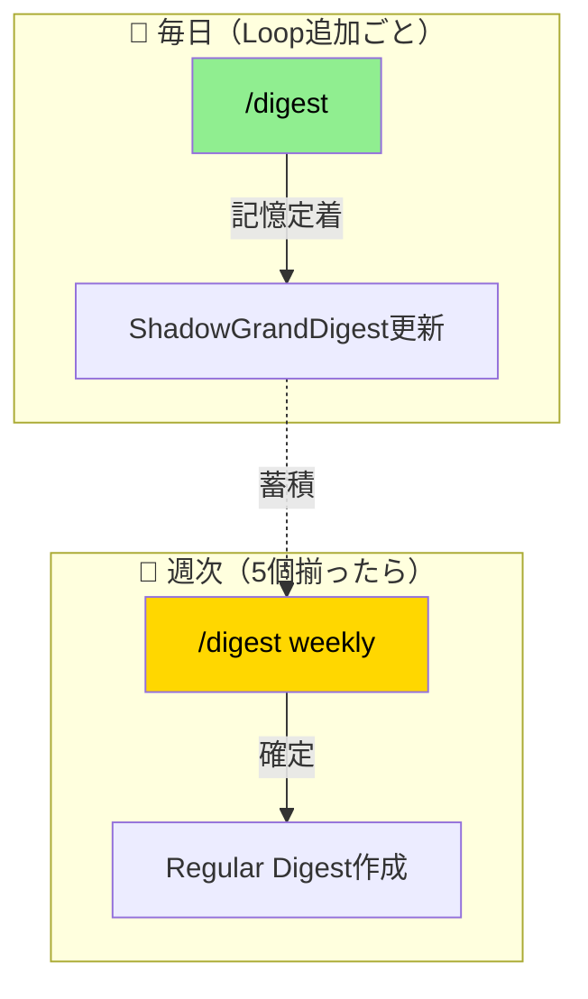

[EpisodicRAG](../../README.md) > [Docs](../README.md) > FAQ

# よくある質問 (FAQ)

EpisodicRAGプラグインに関するよくある質問と回答集です。

---

## このドキュメントの使い方

| 質問の種類 | 参照先 |
|-----------|--------|
| 「〜とは何か」「なぜ〜か」という**概念的な疑問** | **このドキュメント（FAQ）** |
| 「〜が動かない」「〜を修復したい」という**具体的な問題解決** | [TROUBLESHOOTING.md](TROUBLESHOOTING.md) |

> 💡 FAQ で概念を理解し、問題が発生したら TROUBLESHOOTING で解決手順を確認してください。

## 目次

- [一般的な質問](#一般的な質問)
- [導入・セットアップ](#導入セットアップ)
- [日常的な使い方](#日常的な使い方)
- [パフォーマンスと最適化](#パフォーマンスと最適化)
- [バックアップと復旧](#バックアップと復旧)
- [マルチユーザー・同時アクセス](#マルチユーザー同時アクセス)
- [他ツールとの連携](#他ツールとの連携)
- [トラブルシューティング](#トラブルシューティング)
- [開発者向け](#開発者向け)
- [関連ドキュメント](#関連ドキュメント)

---

## 一般的な質問

### Q: EpisodicRAGとは何ですか？

**A**: AI会話履歴を8階層で構造化し、セッション間で記憶を引き継ぐプラグインです。

> 📖 詳細: [用語集](../../README.md)

### Q: 無料で使えますか？

**A**: 個人・非商用利用はMITライセンスで自由に利用可能。商用利用は特許権の関係で事前相談が必要です。

### Q: どのAI環境で動作しますか？

**A**: Claude Code（CLI）、Claude VSCode Extension、Claude WebChat（一部制限）で動作します。

---

## 導入・セットアップ

### Q: インストールに失敗します

**A**: マーケットプレイス追加（`/marketplace list`で確認）→ プラグイン名確認（`EpisodicRAG-Plugin@Plugins-Weave`）→ ネットワーク確認の順でチェック。

> 📖 詳細: [QUICKSTART.md](QUICKSTART.md)

### Q: 設定ファイルが見つかりません

**A**: `@digest-setup` を実行。設定ファイルは自動作成されます。

### Q: パスが正しく解決されません

**A**: `@digest-config` で設定を確認・修正。確認ポイント：

1. **base_dir**: 相対パス（プラグインルート基準）または絶対パス（`~/`展開サポート）
2. **trusted_external_paths**: 外部パス使用時はホワイトリスト登録が必要（v4.0.0+）

> 📖 詳細: [用語集](../../README.md#基本概念)、[api/config.md](../dev/api/config.md#configjson-詳細仕様)

### Q: trusted_external_pathsとは何ですか？

**A**: v4.0.0で導入されたセキュリティ機能です。プラグインディレクトリ外のファイル（例：`~/DEV/Identity.md`）にアクセスする場合、config.jsonで明示的にホワイトリスト登録が必要です。

```json
{
  "trusted_external_paths": ["~/DEV/Identity.md"]
}
```

> 📖 詳細: [用語集](../../README.md#trusted_external_paths)、[TROUBLESHOOTING.md](TROUBLESHOOTING.md#外部パスアクセスエラー)

---

## 日常的な使い方

### Q: Loopファイルの命名規則は？

**A**: `L[5桁連番]_[タイトル].txt` の形式です。

**例**: `L00001_認知アーキテクチャ論.txt`、`L00225_プロジェクト振り返り.txt`

> 📖 詳細（正規表現・連番ルール）: [用語集](../../README.md#ファイル命名規則)

### Q: `/digest`と`/digest weekly`の違いは？

**A**:
- **`/digest`**: Loopを追加したら都度実行（記憶定着）
- **`/digest weekly`**: 5個溜まったら実行（確定）



> 📖 実行フロー・データフローの詳細は [GUIDE.md > /digestの動作](GUIDE.md#digest-の動作) を参照

### Q: まだらボケとは何ですか？

**A**: AIがLoopの内容を記憶できていない状態です。`Loop追加 → /digest`のサイクルで予防できます。

> 📖 発生パターン・対策・記憶定着サイクルの詳細は [用語集](../../README.md#まだらボケ) を参照

### Q: threshold（閾値）を変更したい

**A**: `@digest-config` → [4] Thresholds を選択。

> 📖 詳細: [api/config.md](../dev/api/config.md)

---

## パフォーマンスと最適化

### Q: 100件以上のLoopファイルがある場合、パフォーマンスに影響はありますか？

**A**: EpisodicRAGは大量のファイルを効率的に処理するよう設計されています。

- ファイルスキャンは増分検出（`last_digest_times.json`）で最適化
- 1000ファイルでも5秒以内で検出完了
- メモリ使用量は500ダイジェストで1MB未満

### Q: ストレージ要件はどのくらいですか？

**A**: 目安として：

| ファイル種類 | サイズ目安 |
|------------|----------|
| Loopファイル | 1-10KB/件 |
| Weeklyダイジェスト | 5-20KB/件 |
| ShadowGrandDigest | 50-200KB |
| GrandDigest | 100-500KB |

**例**: 100 Loops + 20 Weeklies ≈ 2-3MB

---

## バックアップと復旧

### Q: バックアップはどのように取るべきですか？

**A**: 以下のディレクトリをバックアップしてください（優先順）：

1. `{loops_dir}/` - 元データ（**最重要**）
2. `{essences_dir}/` - GrandDigest, ShadowGrandDigest
3. `.claude-plugin/config.json` - 設定
4. `.claude-plugin/last_digest_times.json` - 状態追跡

> 💡 `{loops_dir}/` さえあれば他は再構築可能です。

### Q: ShadowGrandDigestが破損した場合の復旧方法は？

**A**:
1. `ShadowGrandDigest.txt`を削除
2. `/digest` を実行して再構築

> 📖 詳細: [TROUBLESHOOTING.md](TROUBLESHOOTING.md#shadowgranddigestが更新されない)

### Q: 誤ってファイルを削除してしまいました

**A**: 復旧手順は削除したファイルによって異なります：

| 削除ファイル | 復旧方法 |
|------------|---------|
| Loopファイル | Gitバックアップから復元、または手動で再作成 |
| ShadowGrandDigest | `/digest`を実行して再生成 |
| GrandDigest | `/digest weekly`を実行して再生成 |
| config.json | `@digest-setup`を実行して再作成 |

---

## マルチユーザー・同時アクセス

### Q: 複数人で同じリポジトリを使えますか？

**A**: 現在の設計は**単一ユーザー**を想定しています。

- **読み取り**: 問題なし（複数人で同時閲覧可能）
- **書き込み**: 競合の可能性あり（同時に`/digest`を実行すると不整合が発生する可能性）

> 💡 チーム利用の場合は、各メンバーが独自のプラグインインスタンスを持つことを推奨します。

### Q: 同時に複数のターミナルから操作できますか？

**A**: 推奨しません。

- `/digest`実行中に別ターミナルで`/digest`を実行するとファイル競合が発生する可能性があります
- 1つのターミナルで操作を完了してから次の操作を開始してください

---

## 他ツールとの連携

### Q: 他のClaude Codeプラグインと併用できますか？

**A**: はい。EpisodicRAGは独立して動作します。

- 設定ディレクトリは`.claude-plugin/`で分離
- 他プラグインとの干渉なし
- コマンド名が重複しない限り問題なく併用可能

### Q: GitHubとの連携は可能ですか？

**A**: はい。[ADVANCED.md](ADVANCED.md)でGitHub連携の設定方法を説明しています。

- Loops/Essencesディレクトリをリポジトリに含める
- `.gitignore`でキャッシュファイルを除外
- 複数デバイス間での記憶共有が可能

---

## トラブルシューティング

問題が発生した場合は [TROUBLESHOOTING.md](TROUBLESHOOTING.md) を参照してください。

症状別の解決手順、診断フローチャート、デバッグ方法が記載されています。

---

## 開発者向け

### Q: 新しい階層を追加できますか？

**A**: はい。`config.json`にthreshold追加 + `domain/constants.py`のLEVEL_CONFIG更新で可能。

> 📖 詳細: [ARCHITECTURE.md](../dev/ARCHITECTURE.md#拡張性)

### Q: カスタムエージェントを作成できますか？

**A**: はい。DigestAnalyzerをベースにカスタム分析ロジックを実装可能（ドメイン専用、多言語対応、感情分析など）。

### Q: テストの実行方法は？

**A**: `cd scripts && python -m pytest test/ -v`

> 📖 詳細: [ARCHITECTURE.md](../dev/ARCHITECTURE.md#テスト)、[CONTRIBUTING.md](../../CONTRIBUTING.md#テスト)

### Q: スキルをCLIで直接実行できますか？

**A**: はい。v4.0.0からスキルはPythonスクリプトとしても実行可能です。

| スキル | CLIコマンド |
|--------|-------------|
| @digest-setup | `python -m interfaces.digest_setup` |
| @digest-config | `python -m interfaces.digest_config` |
| @digest-auto | `python -m interfaces.digest_auto` |

> 📖 詳細: 各スキルの [SKILL.md](../../skills/) を参照

### Q: ドキュメント内で特定のキーワードを検索したい

**A**: GitHubの検索機能またはローカル検索を使用してください。

```text
# リポジトリ内検索（GitHub Web）
https://github.com/Bizuayeu/Plugins-Weave で "キーワード" を検索

# ローカル検索（VS Code）
Ctrl+Shift+F → plugins-weave フォルダで検索
```

> 💡 主要な用語は [用語集](../../README.md#用語インデックス) にインデックスがあります。

---

## 関連ドキュメント

- [用語集](../../README.md) - 用語・共通概念
- [QUICKSTART.md](QUICKSTART.md) - 5分チュートリアル
- [GUIDE.md](GUIDE.md) - ユーザーガイド
- [CHEATSHEET.md](CHEATSHEET.md) - コマンド早見表
- [TROUBLESHOOTING.md](TROUBLESHOOTING.md) - 詳細なトラブルシューティング
- [ARCHITECTURE.md](../dev/ARCHITECTURE.md) - 技術仕様
- [CHANGELOG.md](../../CHANGELOG.md) - バージョン別変更履歴

---
**EpisodicRAG** by Weave | [GitHub](https://github.com/Bizuayeu/Plugins-Weave)
