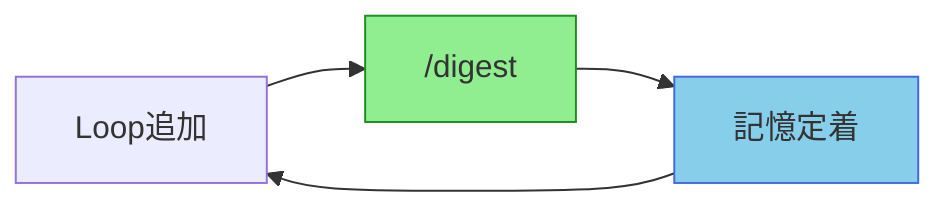
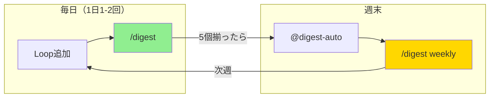
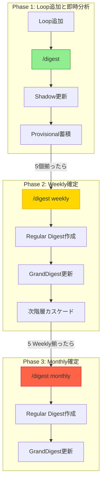

[EpisodicRAG](../../README.md) > [Docs](../README.md) > GUIDE

# EpisodicRAG Plugin ユーザーガイド

このガイドでは、EpisodicRAGを日常的に使いこなすための実践的な知識を提供します。

## 目次

1. [基本原則](#1-基本原則)
2. [コマンドとスキル](#2-コマンドとスキル)
3. [日常ワークフロー](#3-日常ワークフロー)
4. [設定のカスタマイズ](#4-設定のカスタマイズ)
5. [困ったときは](#5-困ったときは)

---

## 1. 基本原則

### 記憶定着サイクル

EpisodicRAGの最も重要な原則は、**Loopを追加したら都度 `/digest` を実行する**ことです。



**やるべきこと:**
```text
L00001追加 → /digest → L00002追加 → /digest → ...
```

**やってはいけないこと:**
```text
L00001追加 → L00002追加 → /digest
                 ↑
       この時点でL00001の内容をAIは覚えていない（まだらボケ）
```

> 📖 まだらボケの詳細は [用語集](../../README.md#まだらボケ) を参照

---

## 2. コマンドとスキル

### 主なコマンド

| コマンド | 説明 | 使用タイミング |
|---------|------|---------------|
| `/digest` | 新規Loop検出と分析 | Loopを追加したら都度 |
| `/digest weekly` | Weekly Digest確定 | 5個のLoopが揃ったら |
| `/digest monthly` | Monthly Digest確定 | 5個のWeeklyが揃ったら |

### 主なスキル

| スキル | 説明 | 使用タイミング |
|--------|------|---------------|
| `@digest-auto` | システム状態確認と推奨アクション | 定期的に、または迷ったとき |
| `@digest-setup` | 初期セットアップ | 初回のみ |
| `@digest-config` | 設定変更 | threshold変更したいとき |

### `/digest` の動作

**引数なし（`/digest`）:**
1. 新しいLoopファイルを検出
2. DigestAnalyzerで分析
3. ShadowGrandDigest.txt更新
4. 次のアクション提示（「あとN個必要」等）

**階層指定（`/digest weekly`等）:**
1. 対象階層の内容確認
2. タイトル提案とユーザー承認
3. Regular Digest作成
4. 次階層へカスケード

> 📖 詳細なデータフローは [ARCHITECTURE.md](../dev/ARCHITECTURE.md#データフロー) を参照

---

## 3. 日常ワークフロー

### 週次運用パターン



**毎日（Loopを追加するたび）:**
```text
1. LXXXXX_タイトル.txt を配置
2. /digest  # 即座に記憶定着
```

**週末（5個揃ったら）:**
```text
3. @digest-auto  # 状態確認
4. /digest weekly  # Weekly Digest確定
```

### 月次運用パターン

**毎週末:**
```text
/digest weekly  # Weekly Digest確定
```

**月末（5週分揃ったら）:**
```text
@digest-auto  # 状態確認
/digest monthly  # Monthly Digest確定
```

### 完全フロー図



---

## 4. 設定のカスタマイズ

### 設定変更方法

設定を変更する最も簡単な方法は、`@digest-config` スキルを使用することです：

```bash
@digest-config
```

対話形式で設定を変更できます。

### 設定ファイルの場所

```text
~/.claude/plugins/EpisodicRAG-Plugin@Plugins-Weave/.claude-plugin/config.json
```

### 主な設定項目

| 設定 | 説明 | デフォルト |
|------|------|-----------|
| `base_dir` | データ基準ディレクトリ | `"."` |
| `paths.loops_dir` | Loopファイル配置先 | `"data/Loops"` |
| `levels.weekly_threshold` | Weekly生成に必要なLoop数 | `5` |
| `levels.monthly_threshold` | Monthly生成に必要なWeekly数 | `5` |

> 📖 完全な設定仕様は [API_REFERENCE.md](../dev/API_REFERENCE.md) を参照

### パス設定について

データの保存場所は `base_dir` で指定します：

| 設定 | データの保存先 | 用途 |
|------|--------------|------|
| `"base_dir": "."` | プラグイン内 `data/` | デフォルト |
| `"base_dir": "C:/GoogleDrive/..."` | 指定した場所の `data/` | クラウド同期 |

現在の設定確認: `@digest-config`

---

## 5. 困ったときは

### クイックリファレンス

| 困っていること | 解決方法 |
|--------------|---------|
| 概念がわからない | [FAQ.md](FAQ.md) |
| 具体的な問題を解決したい | [TROUBLESHOOTING.md](TROUBLESHOOTING.md) |
| システム状態を確認したい | `@digest-auto` を実行 |
| 設定を変更したい | `@digest-config` を実行 |

### よくある症状

1. **Loopファイルが検出されない** → `@digest-auto` で状態確認
2. **パスが解決できない** → `@digest-config` でパス設定を確認

> 📖 詳細な解決手順は [TROUBLESHOOTING.md](TROUBLESHOOTING.md) を参照

---

## 次のステップ

- 📙 **技術仕様を理解したい**: [ARCHITECTURE.md](../dev/ARCHITECTURE.md)
- 🔧 **GitHub連携を設定したい**: [ADVANCED.md](ADVANCED.md)
- 🆘 **高度な問題に直面した**: [TROUBLESHOOTING.md](TROUBLESHOOTING.md)
- 🛠️ **開発に参加したい**: [CONTRIBUTING.md](../../CONTRIBUTING.md)

---
**EpisodicRAG** by Weave | [GitHub](https://github.com/Bizuayeu/Plugins-Weave)
