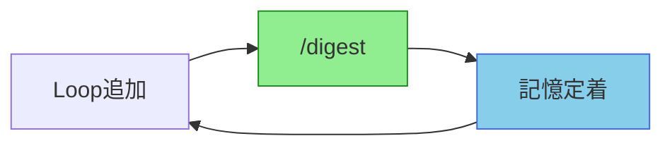
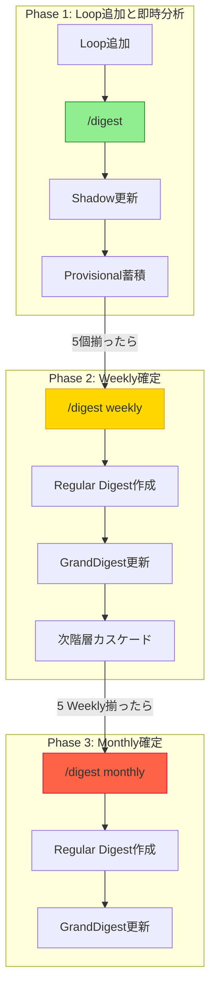
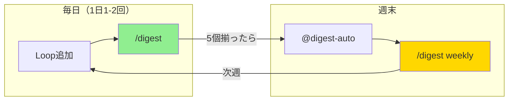

[Docs](../README.md) > GUIDE

# EpisodicRAG Plugin ユーザーガイド

このガイドでは、EpisodicRAGを日常的に使いこなすための実践的な知識を提供します。

## 目次

1. [重要な概念の理解](#1-重要な概念の理解)
2. [コマンド・スキル・エージェント詳解](#2-コマンドスキルエージェント詳解)
3. [設定のカスタマイズ](#3-設定のカスタマイズ)
4. [よくある問題と解決方法](#4-よくある問題と解決方法)
5. [ワークフロー例](#5-ワークフロー例)

---

## 1. 重要な概念の理解

### まだらボケとは

> 📖 まだらボケの定義・発生パターン・記憶定着サイクルの詳細は [用語集](../../README.md#まだらボケ) を参照

**基本原則**: Loopファイルを追加したら都度 `/digest` を実行



---

### Provisional vs Regular Digest

> 📖 用語定義: [用語集](../../README.md#provisional-digest) を参照

#### Provisional Digest（仮ダイジェスト）

- DigestAnalyzer が生成した individual_digests を一時保存
- `Digests/1_Weekly/Provisional/W0001_Individual.txt` のように配置（Loopファイルは `L00001` 形式）
- 複数回の `/digest` で追加可能（`--append` モード）
- `/digest <type>` 実行時に Regular Digest にマージされる

#### Regular Digest（正式ダイジェスト）

- Provisional をマージして overall_digest と individual_digests を統合
- `Digests/2025-07-01_W0001_タイトル.txt` のように配置
- GrandDigest.txt に記録され、次階層の source_files となる
- 確定後は Provisional ファイルは削除（クリーンアップ）

---

### long/short 版の使い分け

DigestAnalyzer は各ファイルに対して long版 と short版 を生成します：

| 項目 | long版 | short版 |
|------|--------|---------|
| **用途** | 現階層の overall_digest | 次階層の individual_digests |
| **abstract** | 2400文字（全体統合分析） | 1200文字（個別分析） |
| **impression** | 800文字（所感・展望） | 400文字（所感・考察） |
| **保存先** | ShadowGrandDigest.txt | Provisional Digest |

**データフロー**:
```
DigestAnalyzer 並列起動
  ↓
long版 → ShadowGrandDigest.txt 更新（現階層overall用）
short版 → Provisional Digest 保存（次階層individual用）
```

---

## 2. コマンド・スキル・エージェント詳解

### `/digest` コマンド

新しいLoopファイルの検出と分析（まだらボケ回避）

**使用例:**
```bash
/digest  # 新規Loop検出と分析
```

**実行フロー:**
1. 新しいLoopファイルを検出
2. ShadowGrandDigest.weeklyにプレースホルダー追加
3. **DigestAnalyzer並列起動**（各Loopファイルごと）
   - long版: ShadowGrandDigest.txt のプレースホルダーを置換
   - short版: Provisional Digest に保存（`--append`モード）
4. ShadowGrandDigest.txt 更新（long版統合）
5. 次のアクション提示

**データフロー:**
```
未処理Loop検出
  ↓
DigestAnalyzer 並列起動（各Loopごと）
  ↓
long版 → ShadowGrandDigest.weekly 更新
short版 → Provisional/1_Weekly/W0001_Individual.txt（--append）
  ↓
次のアクション提示（「あと N個必要」または「/digest weekly で確定可能」）
```

---

### `/digest <type>` コマンド

特定階層の確定

**使用例:**
```bash
/digest weekly    # Weekly Digest確定
/digest monthly   # Monthly Digest確定
/digest quarterly # Quarterly Digest確定
```

**実行フロー:**
1. ShadowGrandDigest.<type> の内容確認
2. **プレースホルダー判定**:
   - 未分析状態 → DigestAnalyzer並列起動
   - 分析済み → タイトル提案へスキップ
3. DigestAnalyzer 並列起動（未分析の場合）
   - long版: ShadowGrandDigest.<type> のoverall_digest更新
   - short版: 次階層用 Provisional 作成（新規作成、`--append`なし）
4. タイトル提案とユーザー承認
5. **finalize_from_shadow.py 実行**:
   - Regular Digest 作成（overall_digest + Provisional マージ）
   - GrandDigest 更新
   - 次階層 Shadow へカスケード
   - Provisional ファイル削除

**データフロー:**
```
ShadowGrandDigest.weekly確認
  ↓
DigestAnalyzer 並列起動（各source_fileごと）
  ↓
long版 → ShadowGrandDigest.weekly.overall_digest更新
short版 → 2_Monthly/Provisional/M001_Individual.txt（新規）
  ↓
タイトル提案 → ユーザー承認
  ↓
finalize_from_shadow.py weekly "タイトル"
  ↓
Regular Digest作成:
  - overall_digest（Shadowからコピー）
  - individual_digests（Provisional/1_Weekly/W0001_Individual.txtをマージ）
  ↓
GrandDigest更新 + 次階層Shadowカスケード + Provisionalクリーンアップ
```

---

### `@digest-auto` スキル

現在の状態確認と推奨アクション提示

システムの状態を分析し、生成可能なダイジェスト階層を判定して、次に何をすべきかを教えてくれます。

**機能:**
- **未処理Loop検出**（ケース1: まだらボケ予防）
- **プレースホルダー検出**（ケース2: `/digest`エラー後の未分析状態）
- **中間ファイルスキップ検出**（連番欠落による記憶の断片化）
- 生成可能な階層判定
- 推奨アクション提示

**使用例:**
```bash
@digest-auto
```

**出力例（未処理Loop検出時）:**
```
━━━━━━━━━━━━━━━━━━━━━━━━━━━━━━━━━━━
⚠️ 未処理Loop検出（まだらボケ予防）
━━━━━━━━━━━━━━━━━━━━━━━━━━━━━━━━━━━

未処理のLoopファイルが 1個 あります

  📝 未処理Loop:
     - L00001_認知アーキテクチャ論

━━━━━━━━━━━━━━━━━━━━━━━━━━━━━━━━━━━
🔴 先に `/digest` を実行してください
━━━━━━━━━━━━━━━━━━━━━━━━━━━━━━━━━━━

理由: `/digest` を実行しないと、これらのLoopの内容を
      AIは記憶できません（まだらボケ状態）

重要: Loopを追加したら都度 `/digest` で記憶を定着させる
      これがEpisodicRAGの基本原則です
```

---

### `@digest-setup` / `@digest-config` スキル

#### `@digest-setup`（初期セットアップ）

プラグインの初期設定を行います。パス設定、threshold設定などを対話形式で設定できます。

**使用例:**
```bash
@digest-setup
```

#### `@digest-config`（設定変更）

既存の設定を変更します。パス、threshold などを対話形式で変更できます。

**使用例:**
```bash
@digest-config
```

---

### `DigestAnalyzer` エージェント

詳細なダイジェスト分析専門エージェント

Loop/Digestファイルを深層分析し、long版とshort版の両方を生成します。

**主な役割:**
- Loop/Digest ファイルの深層分析
- long版（overall用: abstract 2400文字、impression 800文字）
- short版（individual用: abstract 1200文字、impression 400文字）
- 並列起動による効率的な分析

> 📖 呼び出しパターン・パラメータ仕様の詳細は [agents/digest-analyzer.md](../../agents/digest-analyzer.md) を参照

---

## 3. 設定のカスタマイズ

### 対話的な設定変更（推奨）

設定を変更する最も簡単な方法は、`@digest-config` スキルを使用することです：

```bash
@digest-config
```

対話形式で設定を変更できます。

---

### 設定ファイルの場所

`~/.claude/plugins/EpisodicRAG-Plugin@Plugins-Weave/.claude-plugin/config.json`

Plugin内に完全自己完結しており、プロジェクトルートをクリーンに保ちます。

---

### 設定ファイル仕様（クイックリファレンス）

`config.json` は `@digest-setup` で自動生成されますが、手動編集も可能です。

> 📖 パス用語（plugin_root / base_dir / paths）の詳細は [用語集](../../README.md#基本概念) を参照

#### JSONスキーマ

| フィールド | 型 | 説明 | デフォルト |
|-----------|-----|------|-----------|
| `base_dir` | string | プラグインルートからの相対パス | `"."` |
| `paths.loops_dir` | string | Loopファイル配置先（base_dirからの相対） | `"data/Loops"` |
| `paths.digests_dir` | string | Digest出力先 | `"data/Digests"` |
| `paths.essences_dir` | string | GrandDigest配置先 | `"data/Essences"` |
| `paths.identity_file_path` | string\|null | アイデンティティファイルパス | `null` |
| `levels.*_threshold` | int | 各階層の生成に必要なファイル数 | 5, 5, 3, 4, 3, 3, 3, 4 |

> 📖 **詳細仕様**: config.jsonの完全なフィールド説明、設定パターン例、パス解決の仕組みは [API_REFERENCE.md](../dev/API_REFERENCE.md#config.json-詳細仕様) を参照

#### 基本設定例

```json
{
  "base_dir": ".",
  "paths": {
    "loops_dir": "data/Loops",
    "digests_dir": "data/Digests",
    "essences_dir": "data/Essences",
    "identity_file_path": null
  },
  "levels": {
    "weekly_threshold": 5,
    "monthly_threshold": 5,
    "quarterly_threshold": 3,
    "annual_threshold": 4,
    "triennial_threshold": 3,
    "decadal_threshold": 3,
    "multi_decadal_threshold": 3,
    "centurial_threshold": 4
  }
}
```

#### 設定の確認

```bash
cd ~/.claude/plugins/EpisodicRAG-Plugin@Plugins-Weave
python scripts/config.py --show-paths
```

---

## 4. よくある問題と解決方法

### クイックリファレンス

| 困っていること | 解決方法 |
|--------------|---------|
| 概念がわからない | [FAQ.md](FAQ.md) |
| 具体的な問題を解決したい | [TROUBLESHOOTING.md](TROUBLESHOOTING.md) |
| システム状態を確認したい | `@digest-auto` を実行 |
| 設定を変更したい | `@digest-config` を実行 |

### よくある症状と対処

1. **Loopファイルが検出されない** → `@digest-auto` で状態確認
2. **DigestAnalyzerが起動しない** → [TROUBLESHOOTING.md](TROUBLESHOOTING.md#digestanalyzerエージェントが起動しない)
3. **パスが解決できない** → `@digest-config` でパス設定を確認

> 📖 詳細な解決手順は [TROUBLESHOOTING.md](TROUBLESHOOTING.md) を参照

---

## 5. ワークフロー例

### 完全フロー: 未処理Loop → Provisional → Regular



#### Phase 1: Loop追加と即時分析（まだらボケ回避）

```
1. L00001_タイトル.txt を Loops/ に配置

2. `/digest` 実行
   ↓
   未処理Loop検出 → L00001
   ↓
   ShadowGrandDigest.weekly にプレースホルダー追加
   ↓
   DigestAnalyzer起動（L00001を分析）
   ↓
   long版 → ShadowGrandDigest.weekly のプレースホルダー置換
   short版 → save_provisional_digest.py weekly '<JSON>' --append
           → Provisional/1_Weekly/W0001_Individual.txt に追加
   ↓
   ShadowGrandDigest.txt 更新（long版統合）
   ↓
   「あと4個のLoopが必要です」

3. L00002-L00005 を同様に追加・分析
   各Loopごとに `/digest` を実行
   ↓
   Provisional/1_Weekly/W0001_Individual.txt に蓄積
```

#### Phase 2: Weekly Digest 確定

```
4. `/digest weekly` 実行（5個揃った時点）
   ↓
   ShadowGrandDigest.weekly 確認
   ↓
   プレースホルダー判定（分析済みの場合はスキップ）
   ↓
   タイトル提案 → ユーザー承認
   ↓
   finalize_from_shadow.py weekly "承認されたタイトル"
   ↓
   Regular Digest作成:
     - overall_digest（ShadowGrandDigest.weeklyからコピー）
     - individual_digests（Provisional/1_Weekly/W0001_Individual.txtをマージ）
   ↓
   ファイル保存: Digests/2025-07-01_W0001_タイトル.txt
   ↓
   GrandDigest.txt 更新（weeklyセクションに追加）
   ↓
   次階層Shadowカスケード:
     - ShadowGrandDigest.monthly にプレースホルダー追加
     - 次階層用 Provisional 作成（2_Monthly/Provisional/M001_Individual.txt）
   ↓
   Provisional/1_Weekly/W0001_Individual.txt 削除（クリーンアップ）
```

#### Phase 3: Monthly Digest 生成（5つのWeeklyが揃った時点）

```
5. `/digest monthly` 実行
   ↓
   ShadowGrandDigest.monthly 確認
   ↓
   DigestAnalyzer並列起動（5つのWeekly Digestを分析）
   ↓
   long版 → ShadowGrandDigest.monthly.overall_digest更新
   short版 → 3_Quarterly/Provisional/Q001_Individual.txt（次階層用）
   ↓
   タイトル提案 → ユーザー承認
   ↓
   finalize_from_shadow.py monthly "承認されたタイトル"
   ↓
   Regular Digest作成（2_Monthly/Provisional/M001_Individual.txtをマージ）
   ↓
   GrandDigest.txt 更新 + Quarterlyカスケード + Provisionalクリーンアップ
```

---

### 週次運用パターン



**毎日（1日1-2回）:**
```bash
# 新しい会話があったら
1. LXXXXX_タイトル.txt を配置
2. /digest  # 即座に記憶定着
```

**週末（5個揃ったら）:**
```bash
3. @digest-auto  # 状態確認
4. /digest weekly  # Weekly Digest確定
```

**メリット**: 記憶の断片化を防ぎ、常に最新の状態を維持

---

### 月次運用パターン

**毎週末:**
```bash
1. /digest weekly  # Weekly Digest確定
```

**月末（5週分揃ったら）:**
```bash
2. @digest-auto  # 状態確認
3. /digest monthly  # Monthly Digest確定
```

**メリット**: 月単位での記憶の整理と長期保存

---

## 次のステップ

- 📙 **技術仕様を理解したい**: [ARCHITECTURE.md](../dev/ARCHITECTURE.md)
- 🔧 **GitHub連携を設定したい**: [ADVANCED.md](ADVANCED.md)
- 🆘 **高度な問題に直面した**: [TROUBLESHOOTING.md](TROUBLESHOOTING.md)
- 🛠️ **開発に参加したい**: [CONTRIBUTING.md](../../CONTRIBUTING.md)

---
**EpisodicRAG** by Weave | [GitHub](https://github.com/Bizuayeu/Plugins-Weave)
