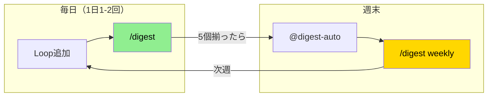

[EpisodicRAG](../../README.md) > [Docs](../README.md) > GUIDE

# EpisodicRAG Plugin ユーザーガイド

> **対応バージョン**: EpisodicRAG Plugin v5.0.0+ / ファイルフォーマット 1.0

このガイドでは、EpisodicRAGを日常的に使いこなすための実践的な知識を提供します。

## 目次

1. [コマンドとスキル](#1-コマンドとスキル)
2. [日常ワークフロー](#2-日常ワークフロー)
3. [設定のカスタマイズ](#3-設定のカスタマイズ)
4. [困ったときは](#4-困ったときは)

> 📖 用語・基本概念は [用語集](../../README.md) を参照

---

## 1. コマンドとスキル

### 主なコマンド

| コマンド | 説明 | 使用タイミング |
|---------|------|---------------|
| `/digest` | 新規Loop検出と分析 | Loopを追加したら都度 |
| `/digest weekly` | Weekly Digest確定 | 5個のLoopが揃ったら |
| `/digest monthly` | Monthly Digest確定 | 5個のWeeklyが揃ったら |

### 主なスキル

| スキル | 説明 | 使用タイミング |
|--------|------|---------------|
| `@digest-auto` | システム状態確認と推奨アクション | 定期的に、または迷ったとき |
| `@digest-setup` | 初期セットアップ | 初回のみ |
| `@digest-config` | 設定変更 | threshold変更したいとき |

> **v4.0.0+**: スキルはPythonスクリプトとしても実行可能:
> `python -m interfaces.digest_auto` / `digest_setup` / `digest_config`

### `/digest` の動作

**引数なし（`/digest`）:**
1. 新しいLoopファイルを検出
2. DigestAnalyzerで分析
3. ShadowGrandDigest.txt更新
4. 次のアクション提示（「あとN個必要」等）

**階層指定（`/digest weekly`等）:**
1. 対象階層の内容確認
2. タイトル提案とユーザー承認
3. Regular Digest作成
4. 次階層へカスケード

> 📖 詳細なデータフローは [ARCHITECTURE.md](../dev/ARCHITECTURE.md#データフロー) を参照

---

## 2. 日常ワークフロー

### 基本サイクル



**毎日（Loopを追加するたび）:**
```text
1. LXXXXX_タイトル.txt を配置
2. /digest  # 即座に記憶定着
```

**週末:**
```text
@digest-auto  # 状態確認
/digest weekly
```

**月末（5 Weekly揃ったら）:**
```text
/digest weekly   # まず今週分を確定
/digest monthly  # → 月次へカスケード
```

> 📖 詳細なデータフローは [ARCHITECTURE.md](../dev/ARCHITECTURE.md#データフロー) を参照

---

## 3. 設定のカスタマイズ

### 設定変更方法

設定を変更する最も簡単な方法は、`@digest-config` スキルを使用することです：

```ClaudeCLI
@digest-config
```

### 設定ファイルの場所

```text
{plugin_root}/.claude-plugin/config.json
```

> 📖 `plugin_root` の環境別パスは [用語集](../../README.md#パス形式の違い) を参照

### 主な設定項目

| 設定 | 説明 | デフォルト |
|------|------|-----------|
| `base_dir` | データ基準ディレクトリ | `"."` |
| `paths.loops_dir` | Loopファイル配置先 | `"data/Loops"` |
| `levels.weekly_threshold` | Weekly生成に必要なLoop数 | `5` |

> 📖 完全な設定仕様は [api/config.md](../dev/api/config.md) を参照

### 外部パス設定（v4.0.0+）

プラグイン外のパス（Google Drive等）を使用するには `trusted_external_paths` での許可が必要です。

```json
{
  "base_dir": "~/Google Drive/EpisodicRAG",
  "trusted_external_paths": ["~/Google Drive"]
}
```

設定: `@digest-config` → trusted_external_paths を選択

> 📖 詳細は [TROUBLESHOOTING.md](TROUBLESHOOTING.md#外部パス設定エラー) を参照

---

## 4. 困ったときは

### クイックリファレンス

| 困っていること | 解決方法 |
|--------------|---------|
| 概念がわからない | [FAQ.md](FAQ.md) |
| 具体的な問題を解決したい | [TROUBLESHOOTING.md](TROUBLESHOOTING.md) |
| システム状態を確認したい | `@digest-auto` を実行 |
| 設定を変更したい | `@digest-config` を実行 |

### よくある症状

1. **Loopファイルが検出されない** → `@digest-auto` で状態確認
2. **パスが解決できない** → `@digest-config` でパス設定を確認

> 📖 詳細な解決手順は [TROUBLESHOOTING.md](TROUBLESHOOTING.md) を参照

---

## 次のステップ

- 📋 **コマンド早見表**: [CHEATSHEET.md](CHEATSHEET.md)
- 📙 **技術仕様を理解したい**: [ARCHITECTURE.md](../dev/ARCHITECTURE.md)
- 🔧 **GitHub連携を設定したい**: [ADVANCED.md](ADVANCED.md)
- 🆘 **高度な問題に直面した**: [TROUBLESHOOTING.md](TROUBLESHOOTING.md)
- 🛠️ **開発に参加したい**: [CONTRIBUTING.md](../../CONTRIBUTING.md)

---
**EpisodicRAG** by Weave | [GitHub](https://github.com/Bizuayeu/Plugins-Weave)
