<!-- Last synced: 2025-12-16 -->
English | [日本語](QUICKSTART.md)

# 5-Minute Quickstart

A guide to set up EpisodicRAG as quickly as possible and verify it works.

## Table of Contents

- [Prerequisites](#prerequisites)
- [Overview](#overview)
- [Step 1: Installation](#step-1-installation-1-min)
- [Step 2: Setup](#step-2-setup-1-min)
- [Step 3: Create Sample Loop](#step-3-create-sample-loop-2-min)
- [Step 4: Run Initial Analysis](#step-4-run-initial-analysis-1-min)
- [Success Checklist](#success-checklist)
- [Next Steps](#next-steps)
- [Troubleshooting](#troubleshooting)
- [Related Documentation](#related-documentation)

---

## Prerequisites

- Claude Code or Claude VSCode Extension installed
- Python 3.x installed

---

## Overview

```mermaid
flowchart LR
    A["📦 Step 1: Install"] --> B["⚙️ Step 2: Setup"]
    B --> C["📝 Step 3: Create Loop"]
    C --> D["🔄 Step 4: /digest"]
    D --> E["✅ Done"]

    style A fill:#E8F5E9,color:#000000
    style B fill:#E3F2FD,color:#000000
    style C fill:#FFF3E0,color:#000000
    style D fill:#F3E5F5,color:#000000
    style E fill:#E8F5E9,color:#000000
```



---

## Step 1: Installation (1 min)

### 1-1. Add Marketplace

```ClaudeCLI
/marketplace add https://github.com/Bizuayeu/Plugins-Weave
```

### 1-2. Install Plugin

```ClaudeCLI
/plugin install EpisodicRAG-Plugin@Plugins-Weave
```

---

## Step 2: Setup (1 min)

```ClaudeCLI
@digest-setup
```

Select **[1] (default)** for all questions:

```text
Q1: Loop file location → [1] Persistent directory (recommended)
Q2: Digest file output → [1] Persistent directory (recommended)
Q3: Essences file location → [1] Persistent directory (recommended)
Q4: External Identity.md file → [1] Don't use
Q5-Q12: Threshold for each layer → [1] Default value
```

Confirm the setup completion message:

```text
Setup complete!

Created files:
  - config.json
  - GrandDigest.txt
  - ShadowGrandDigest.txt
```

---

## Step 3: Create Sample Loop (2 min)

> See [Glossary > Loop](../../README.en.md#loop) for file naming conventions

### 3-1. Create a Loop File

Create a file with the following content:

**Filename**: `L00001_TestConversation.txt`

**Location**: `~/.claude/plugins/.episodicrag/data/Loops/` (with default settings)

**Content** (copy-paste ready):

```text
# L00001: Test Conversation

User: Hello, this is a test for EpisodicRAG.
Assistant: Hello! This is a test for EpisodicRAG. How can I help you?
User: Tell me about the memory system.
Assistant: EpisodicRAG is an 8-layer long-term memory system. It saves conversations as Loop files and manages long-term memory by hierarchically digesting them.
```

---

## Step 4: Run Initial Analysis (1 min)

```ClaudeCLI
/digest
```

**Expected output**:

```text
Unprocessed Loop files detected: 1

  - L00001_TestConversation.txt

Starting analysis with DigestAnalyzer...

Analysis complete!
ShadowGrandDigest.txt has been updated
```

---

## Success Checklist

Please verify the following:

- [ ] `@digest-setup` completed successfully
- [ ] Loop file is placed in `~/.claude/plugins/.episodicrag/data/Loops/`
- [ ] `/digest` detected the unprocessed Loop
- [ ] `ShadowGrandDigest.txt` was updated

If all items are checked, setup is complete!

---

## Next Steps

### Check System Status

```ClaudeCLI
@digest-auto
```

This displays the current status and recommended actions.

### Generate Weekly Digest After 5 Loops

```ClaudeCLI
# After adding 5 Loop files
/digest weekly
```

---

## Troubleshooting

If you encounter problems:

1. Check system status with `@digest-auto`
2. Refer to [TROUBLESHOOTING.md](TROUBLESHOOTING.md)
3. Check detailed usage in [GUIDE.md](GUIDE.md)

---

## Related Documentation

> See [Glossary](../../README.en.md) for terminology definitions

- [Glossary](../../README.en.md) - Terms & Concepts
- [GUIDE.md](GUIDE.md) - User Guide
- [CHEATSHEET.en.md](CHEATSHEET.en.md) - Quick Reference
- [ARCHITECTURE.md](../dev/ARCHITECTURE.md) - Technical Specifications

---
**EpisodicRAG** by Weave | [GitHub](https://github.com/Bizuayeu/Plugins-Weave)
