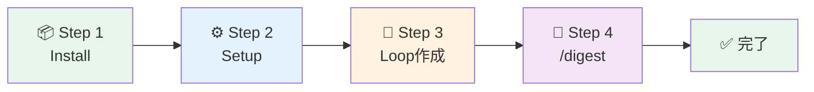

[Docs](../README.md) > QUICKSTART

[English](QUICKSTART.en.md) | 日本語

# 5分クイックスタート

EpisodicRAGを最速でセットアップし、動作確認するためのガイドです。

---

## 前提条件

- Claude Code または Claude VSCode Extension がインストール済み
- Python 3.x がインストール済み

---

## 全体の流れ



---

## Step 1: インストール（1分）

### 1-1. マーケットプレイス追加

```bash
/marketplace add https://github.com/Bizuayeu/Plugins-Weave
```

### 1-2. プラグインインストール

```bash
/plugin install EpisodicRAG-Plugin@Plugins-Weave
```

---

## Step 2: セットアップ（1分）

```bash
@digest-setup
```

すべての質問で **[1]（デフォルト）** を選択してください：

```
Q1: Loopファイルの配置先 → [1] Plugin内（自己完結）
Q2: Digestファイルの出力先 → [1] Plugin内（自己完結）
Q3: Essencesファイルの配置先 → [1] Plugin内（自己完結）
Q4: 外部Identity.mdファイル → [1] 使用しない
Q5〜Q12: 各階層のthreshold → [1] デフォルト値
```

セットアップ完了メッセージを確認：

```
セットアップ完了！

作成されたファイル:
  - config.json
  - GrandDigest.txt
  - ShadowGrandDigest.txt
```

---

## Step 3: サンプルLoop作成（2分）

### 3-1. Loopファイルを作成

以下の内容でファイルを作成します：

**ファイル名**: `L00001_テスト会話.txt`

**配置先**: `~/.claude/plugins/EpisodicRAG-Plugin@Plugins-Weave/data/Loops/`

**内容**（コピペ可能）:

```
# L00001: テスト会話

User: こんにちは、EpisodicRAGのテストです。
Assistant: こんにちは！EpisodicRAGのテストですね。何かお手伝いできることはありますか？
User: 記憶システムについて教えてください。
Assistant: EpisodicRAGは8階層の長期記憶システムです。会話をLoopファイルとして保存し、階層的にダイジェスト化することで、長期間の記憶を管理します。
```

---

## Step 4: 初回分析実行（1分）

```bash
/digest
```

**期待される出力**:

```
未処理のLoopファイルを検出しました: 1個

  - L00001_テスト会話.txt

DigestAnalyzerで分析を開始します...

分析完了！
ShadowGrandDigest.txt を更新しました
```

---

## 成功確認チェックリスト

以下を確認してください：

- [ ] `@digest-setup` が正常に完了した
- [ ] Loopファイルが `data/Loops/` に配置されている
- [ ] `/digest` で未処理Loopが検出された
- [ ] `ShadowGrandDigest.txt` が更新された

すべてチェックできたら、セットアップ完了です！

---

## 次のステップ

### システム状態を確認

```bash
@digest-auto
```

現在の状態と推奨アクションが表示されます。

### 5個のLoopを貯めてWeekly Digestを生成

```bash
# 5個のLoopファイルを追加後
/digest weekly
```

---

## トラブルシューティング

問題が発生した場合：

1. `@digest-auto` でシステム状態を確認
2. [TROUBLESHOOTING.md](TROUBLESHOOTING.md) を参照
3. [GUIDE.md](GUIDE.md) で詳細な使い方を確認

---

## 関連ドキュメント

- [用語集](../../README.md) - 用語・共通概念
- [GUIDE.md](GUIDE.md) - ユーザーガイド
- [ARCHITECTURE.md](../dev/ARCHITECTURE.md) - 技術仕様

---
**EpisodicRAG** by Weave | [GitHub](https://github.com/Bizuayeu/Plugins-Weave)
