[EpisodicRAG](../../README.md) > [Docs](../README.md) > QUICKSTART

[English](QUICKSTART.en.md) | 日本語

# 5分クイックスタート

EpisodicRAGを最速でセットアップし、動作確認するためのガイドです。

## 目次

- [前提条件](#前提条件)
- [全体の流れ](#全体の流れ)
- [Step 1: インストール](#step-1-インストール1分)
- [Step 2: セットアップ](#step-2-セットアップ1分)
- [Step 3: サンプルLoop作成](#step-3-サンプルloop作成2分)
- [Step 4: 初回分析実行](#step-4-初回分析実行1分)
- [成功確認チェックリスト](#成功確認チェックリスト)
- [次のステップ](#次のステップ)
- [トラブルシューティング](#トラブルシューティング)
- [関連ドキュメント](#関連ドキュメント)

---

## 前提条件

- Claude Code または Claude VSCode Extension がインストール済み
- Python 3.x がインストール済み

> **パス変数の凡例**:
> - `{plugin_root}`: プラグインのインストール先（[用語集](../../README.md#pluginroot) 参照）
> - `{loops_dir}`: config.jsonで設定されたLoopディレクトリ

---

## 全体の流れ

```mermaid
flowchart LR
    A["📦 Step 1: Install"] --> B["⚙️ Step 2: Setup"]
    B --> C["📝 Step 3: Create Loop"]
    C --> D["🔄 Step 4: /digest"]
    D --> E["✅ Done"]

    style A fill:#E8F5E9,color:#000000
    style B fill:#E3F2FD,color:#000000
    style C fill:#FFF3E0,color:#000000
    style D fill:#F3E5F5,color:#000000
    style E fill:#E8F5E9,color:#000000
```



---

## Step 1: インストール（1分）

### 1-1. マーケットプレイス追加

```ClaudeCLI
/marketplace add https://github.com/Bizuayeu/Plugins-Weave
```

### 1-2. プラグインインストール

```ClaudeCLI
/plugin install EpisodicRAG-Plugin@Plugins-Weave
```

---

## Step 2: セットアップ（1分）

```ClaudeCLI
@digest-setup
```

すべての質問で **[1]（デフォルト）** を選択してください：

```
Q1: Loopファイルの配置先 → [1] Plugin内（自己完結）
Q2: Digestファイルの出力先 → [1] Plugin内（自己完結）
Q3: Essencesファイルの配置先 → [1] Plugin内（自己完結）
Q4: 外部Identity.mdファイル → [1] 使用しない
Q5〜Q12: 各階層のthreshold → [1] デフォルト値
```

セットアップ完了メッセージを確認：

```
セットアップ完了！

作成されたファイル:
  - config.json
  - GrandDigest.txt
  - ShadowGrandDigest.txt
```

---

## Step 3: サンプルLoop作成（2分）

> 📖 ファイル命名規則: [用語集](../../README.md#loop)

### 3-1. Loopファイルを作成

以下の内容でファイルを作成します：

**ファイル名**: `L00001_テスト会話.txt`

**配置先**: `{plugin_root}/data/Loops/`（デフォルト設定の場合）

**内容**（コピペ可能）:

```
# L00001: テスト会話

User: こんにちは、EpisodicRAGのテストです。
Assistant: こんにちは！EpisodicRAGのテストですね。何かお手伝いできることはありますか？
User: 記憶システムについて教えてください。
Assistant: EpisodicRAGは8階層の長期記憶システムです。会話をLoopファイルとして保存し、階層的にダイジェスト化することで、長期間の記憶を管理します。
```

---

## Step 4: 初回分析実行（1分）

```ClaudeCLI
/digest
```

**期待される出力**:

```
未処理のLoopファイルを検出しました: 1個

  - L00001_テスト会話.txt

DigestAnalyzerで分析を開始します...

分析完了！
ShadowGrandDigest.txt を更新しました
```

---

## 成功確認チェックリスト

以下を確認してください：

- [ ] `@digest-setup` が正常に完了した
- [ ] Loopファイルが `data/Loops/` に配置されている
- [ ] `/digest` で未処理Loopが検出された
- [ ] `ShadowGrandDigest.txt` が更新された

すべてチェックできたら、セットアップ完了です！

---

## 次のステップ

### システム状態を確認

```ClaudeCLI
@digest-auto
```

現在の状態と推奨アクションが表示されます。

### 5個のLoopを貯めてWeekly Digestを生成

```ClaudeCLI
# 5個のLoopファイルを追加後
/digest weekly
```

---

## トラブルシューティング

問題が発生した場合：

1. `@digest-auto` でシステム状態を確認
2. [TROUBLESHOOTING.md](TROUBLESHOOTING.md) を参照
3. [GUIDE.md](GUIDE.md) で詳細な使い方を確認

---

## 関連ドキュメント

> 📖 用語定義: [用語集](../../README.md)

- [用語集](../../README.md) - 用語・共通概念
- [GUIDE.md](GUIDE.md) - ユーザーガイド
- [CHEATSHEET.md](CHEATSHEET.md) - クイックリファレンス
- [ARCHITECTURE.md](../dev/ARCHITECTURE.md) - 技術仕様

---
**EpisodicRAG** by Weave | [GitHub](https://github.com/Bizuayeu/Plugins-Weave)
