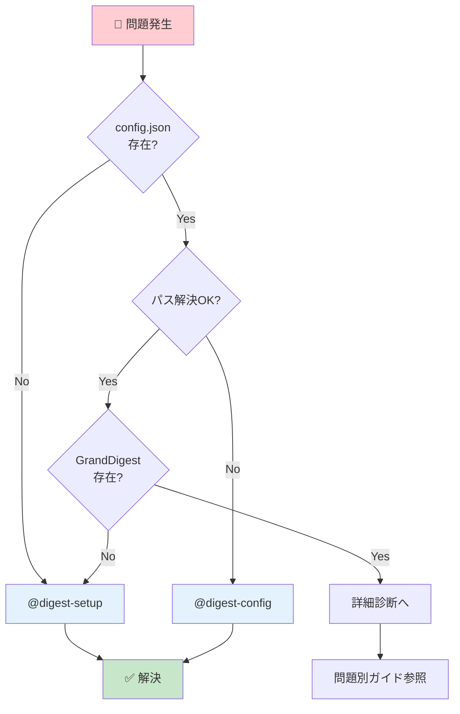

[EpisodicRAG](../../README.md) > [Docs](../README.md) > TROUBLESHOOTING

# Troubleshooting - EpisodicRAG Plugin

このドキュメントでは、EpisodicRAGプラグインで発生する問題の**具体的な解決手順**を提供します。

---

## このドキュメントの使い方

| 質問の種類 | 参照先 |
|-----------|--------|
| 「〜が動かない」「〜を修復したい」という**具体的な問題解決** | **このドキュメント（TROUBLESHOOTING）** |
| 「〜とは何か」「なぜ〜か」という**概念的な疑問** | [FAQ.md](FAQ.md) |
| **用語・命名規則**（ID桁数、ファイル形式） | [用語集](../../README.md) |

> 💡 まず下の「クイック診断フローチャート」で問題を切り分け、該当セクションへ進んでください。

> **対応バージョン**: EpisodicRAG Plugin v3.0.0+ / ファイルフォーマット 1.0
>
> **Note**: v2.0.0以降（最新v3.0.0）はClean Architecture（4層構造）を採用しています。旧パス（`scripts/shadow_grand_digest.py`等）は使用できません。[ARCHITECTURE.md](../dev/ARCHITECTURE.md#clean-architecture)を参照してください。
>
> **v3.0.0変更点**: Loop ID形式が4桁→5桁に変更されました（Loop0001→L00001）。既存ファイルの移行については[Loop ID移行](#loop-id移行v300)を参照してください。

---

## 目次

1. [問題別解決ガイド](#問題別解決ガイド)
   - [外部パス設定エラー](#外部パス設定エラー)
   - [DigestAnalyzerエージェントが起動しない](#digestanalyzerエージェントが起動しない)
   - [individual_digestsが空になる](#individual_digestsが空になる)
   - [ShadowGrandDigestが更新されない](#shadowgranddigestが更新されない)
   - [階層的カスケードが動作しない](#階層的カスケードが動作しない)
   - [Digest生成時のJSON形式エラー](#digest生成時のjson形式エラー)
   - [開発環境とインストール環境の混在](#開発環境とインストール環境の混在)
   - [Loop ID移行（v3.0.0）](#loop-id移行v300)
2. [システム状態の詳細診断](#システム状態の詳細診断)
3. [デバッグモード](#デバッグモード)
4. [サポート](#サポート)

---

## クイック診断フローチャート

問題が発生した場合、まず以下のフローで基本的な問題を切り分けてください：



---

## 問題別解決ガイド

### 外部パス設定エラー

**症状**: 外部パス（Google Drive、別ディレクトリ等）を`base_dir`に設定すると以下のエラーが発生する

```text
ConfigError: Invalid configuration value for 'base_dir': expected path within plugin root or trusted_external_paths, got '~/Google Drive/EpisodicRAG' (resolves outside allowed paths)
```

**原因**: セキュリティ機能により、`base_dir`にプラグイン外のパスを指定するには`trusted_external_paths`での明示的な許可が必要

**解決方法**:

1. **`@digest-config`で対話的に設定**（推奨）:
   ```bash
   @digest-config 外部のデータディレクトリを使いたい
   ```

   手順:
   1. [5] trusted_external_paths を選択
   2. [1] パスを追加
   3. 外部パスの親ディレクトリを入力（例: `~/Google Drive`）
   4. [1] Base directory を選択
   5. 新しいパスを入力（例: `~/Google Drive/EpisodicRAG`）

2. **config.jsonを直接編集**:
   ```json
   {
     "base_dir": "~/Google Drive/EpisodicRAG",
     "trusted_external_paths": ["~/Google Drive"],
     "paths": { ... }
   }
   ```

**重要**:
- `trusted_external_paths`には`base_dir`の親ディレクトリを指定
- 相対パスは使用不可（絶対パスまたはチルダ記法のみ）
- デフォルトは空配列（最もセキュア）

> 📖 詳細は [api/config.md](../dev/api/config.md#trusted_external_paths) を参照

---

### DigestAnalyzerエージェントが起動しない

**症状**: `@DigestAnalyzer`が起動しない、またはエラーが発生する

**確認ポイント**:

1. **config.jsonが存在するか**
   ```bash
   ls ~/.claude/plugins/EpisodicRAG-Plugin@Plugins-Weave/.claude-plugin/config.json
   ```

2. **パス解決が正しいか**（📖 [用語集](../../README.md#基本概念) 参照）
   ```bash
   cd ~/.claude/plugins/EpisodicRAG-Plugin@Plugins-Weave
   python scripts/config.py --show-paths
   ```

3. **GrandDigest.txtが存在するか**
   ```bash
   # 設定されているessences_dirを確認
   python scripts/config.py --show-paths

   # 該当パスのGrandDigest.txtを確認
   ls {essences_dir}/GrandDigest.txt
   ```

**解決方法**:

- **config.jsonが存在しない場合**: `@digest-setup`を実行
- **パス解決エラーの場合**: `@digest-config`で設定を確認・修正
- **GrandDigest.txtが存在しない場合**: 初回セットアップを実行
  ```bash
  @digest-setup
  ```

---

### individual_digestsが空になる

**症状**: Weekly Digestを生成したが、`individual_digests: []`となっている

**原因**: ProvisionalDigestファイルが生成されていない、または読み込めていない

**診断手順**:

1. **ProvisionalDigestディレクトリの確認**:
   ```bash
   # 設定されているdigests_dirを確認
   python scripts/config.py --show-paths

   # Provisionalディレクトリの内容確認
   ls {digests_dir}/1_Weekly/Provisional/
   ```

2. **W0001_Individual.txt形式のProvisionalファイルが存在するか確認**

3. **ファイルの内容が正しいか確認**:
   ```bash
   cat {digests_dir}/1_Weekly/Provisional/W0001_Individual.txt
   ```

**解決方法**:

**ケースA: Provisionalファイルが存在しない**

各Loopに対して`/digest`を再実行:
```bash
/digest  # Loop検出と分析
```

DigestAnalyzerが正しくindividual digestを生成しているか確認してください。

**ケースB: Provisionalファイルは存在するが読み込めていない**

ファイル形式が正しいか確認:
```bash
cat {digests_dir}/1_Weekly/Provisional/W0001_Individual.txt
```

期待される形式:
```json
{
  "metadata": {
    "digest_level": "weekly",
    "digest_number": "0001",
    "last_updated": "2025-11-22T00:00:00",
    "version": "1.0"
  },
  "individual_digests": [
    {
      "filename": "L00001_タイトル.txt",
      "digest_type": "...",
      "keywords": [...],
      "abstract": "...",
      "impression": "..."
    }
  ]
}
```

**ケースC: finalize_from_shadow.pyの実行エラー**

`/digest weekly` 実行時のエラーログを確認:
```bash
# 手動で DigestFinalizerFromShadow を実行してエラー詳細を確認
# v2.0.0+: interfaces層からインポート
cd ~/.claude/plugins/EpisodicRAG-Plugin@Plugins-Weave/scripts
python -c "from interfaces import DigestFinalizerFromShadow; from config import DigestConfig; f = DigestFinalizerFromShadow(DigestConfig()); f.finalize('weekly', 'テストタイトル')"
```

---

### ShadowGrandDigestが更新されない

**症状**: 新しいLoopファイルを追加したが、ShadowGrandDigest.txtに反映されない

**確認ポイント**:

1. **last_digest_times.jsonの内容を確認**
   ```bash
   # .claude-plugin/ 内に配置されています
   cat ~/.claude/plugins/EpisodicRAG-Plugin@Plugins-Weave/.claude-plugin/last_digest_times.json
   ```

2. **新しいLoopファイルが検出されているか**
   ```bash
   @digest-auto
   ```

3. **ShadowGrandDigest.txtの構造確認**
   ```bash
   python scripts/config.py --show-paths  # essences_dirを確認
   cat {essences_dir}/ShadowGrandDigest.txt
   ```

**解決方法**:

1. **未処理Loopの検出と分析**:
   ```bash
   /digest
   ```

2. **last_digest_times.jsonが破損している場合**:
   ```bash
   # バックアップを取ってから削除（.claude-plugin/ 内に配置）
   cd ~/.claude/plugins/EpisodicRAG-Plugin@Plugins-Weave/.claude-plugin
   cp last_digest_times.json last_digest_times.json.bak
   rm last_digest_times.json

   # 再実行（テンプレートから自動再作成されます）
   /digest
   ```

3. **ShadowGrandDigest.txtが破損している場合**:
   ```bash
   # バックアップを取ってから削除
   python scripts/config.py --show-paths  # essences_dirを確認
   cp {essences_dir}/ShadowGrandDigest.txt {essences_dir}/ShadowGrandDigest.txt.bak
   rm {essences_dir}/ShadowGrandDigest.txt

   # 再実行（テンプレートから自動再作成されます）
   # v2.0.0+: ShadowGrandDigestManagerを使用
   cd ~/.claude/plugins/EpisodicRAG-Plugin@Plugins-Weave/scripts
   python -c "from application.grand import ShadowGrandDigestManager; from config import DigestConfig; m = ShadowGrandDigestManager(DigestConfig()); m.load_or_create(); print('OK')"
   ```

---

### 階層的カスケードが動作しない

**症状**: Weekly Digestは生成されるが、Monthly階層にカスケードしない

**確認ポイント**:

1. **GrandDigest.txtの構造確認**
   ```bash
   python scripts/config.py --show-paths  # essences_dirを確認
   cat {essences_dir}/GrandDigest.txt
   ```

2. **Weekly levelのoverall_digestが正しく設定されているか**

   期待される形式（[ARCHITECTURE.md](../dev/ARCHITECTURE.md) 参照）:
```json
{
  "major_digests": {
       "weekly": {
         "overall_digest": {
           "timestamp": "...",
           "source_files": [...],
           "digest_type": "...",
           "keywords": [...],
           "abstract": "...",
           "impression": "..."
         }
       }
     }
   }
   ```

3. **thresholdを満たしているか**
   ```bash
   @digest-auto
   ```

**解決方法**:

1. **Weekly Digestが5個揃っているか確認**:
   ```bash
   python scripts/config.py --show-paths  # digests_dirを確認
   ls {digests_dir}/1_Weekly/
   ```

2. **config.jsonのmonthly_thresholdが正しいか確認**:
   ```bash
   python scripts/config.py
   ```

3. **明示的にMonthly Digestを生成**:
   ```bash
   /digest monthly
   ```

4. **GrandDigest.txtが破損している場合**:

   手動修復（高度）:
   ```bash
   # バックアップ作成
   cp {essences_dir}/GrandDigest.txt {essences_dir}/GrandDigest.txt.bak

   # JSONの構造を確認・修復
   # 必要に応じて手動編集
   ```

---

### Digest生成時のJSON形式エラー

**症状**: DigestAnalyzerの出力JSONが不完全（末尾の`}`が欠けている等）

**原因**:
- 大規模なLoopファイルでトークン制限に達した
- エージェントの出力が途中で切れた

**解決方法**:

**方法1: DigestAnalyzerを再実行**

```bash
# 同じ指示で再実行
@DigestAnalyzer
[前回と同じLoopファイルパスを指定]
```

**方法2: 明示的な指示を追加**

DigestAnalyzerに以下を指示:
```text
最後まで必ず出力してください。
末尾は必ず }}} で終わること
JSON形式を厳密に守ってください
```

**方法3: 大規模Loopファイルの場合**

- Loopファイルを分割（L00001a, L00001b など）
- または段階的読み込みを指示:
  ```text
  まず前半を読み込んで分析し、
  次に後半を読み込んで統合してください
  ```

**方法4: 不完全なJSONの手動修復**

```bash
# 生成されたJSONファイルを確認
cat {path_to_generated_json}

# エディタで開いて末尾を修復
# 例: 欠けている } や ] を追加
```

---

### 開発環境とインストール環境の混在

**症状**: インストール済プラグインをテストしているが、開発フォルダに設定ファイルが作成される

**原因**: 開発フォルダとインストール済プラグインが同じマシンに存在する環境で発生

**診断**:
```bash
cd plugins-weave/EpisodicRAG
git status
```
```text
# 期待: "nothing to commit, working tree clean"
# 問題: config.json や last_digest_times.json が untracked として表示される
```

**解決方法**:

1. **開発フォルダから設定ファイルを削除**:
   ```bash
   cd plugins-weave/EpisodicRAG
   rm .claude-plugin/config.json
   rm .claude-plugin/last_digest_times.json
   git status  # clean を確認
   ```

2. **インストール済プラグインに正しく配置**:
   ```bash
   # config.jsonの場所確認
   cat ~/.claude/plugins/marketplaces/Plugins-Weave/EpisodicRAG/.claude-plugin/config.json
   ```

**重要な原則**:
- **開発フォルダ**: ソースコードのみ（設定ファイルは.gitignoreで除外）
- **インストール済プラグイン**: 実行環境・設定ファイル配置場所（`~/.claude/plugins/marketplaces/`）
- **データディレクトリ**: base_dirからの相対パスで別の場所に配置

**参考**: この問題は開発者が新規インストールをテストする際の特殊ケースです。通常のユーザーは遭遇しません。

---

### Loop ID移行（v3.0.0）

**症状**: v3.0.0へのアップグレード後、既存のLoopファイルが認識されない

**原因**: v3.0.0でLoop ID形式が変更されました（Loop0001→L00001、プレフィックス変更+5桁化）

**確認ポイント**:

1. **現在のLoopファイル名を確認**:
   ```bash
   ls {loops_dir}
   ```

   旧形式: `Loop0001_タイトル.txt`, `Loop0186_タイトル.txt`
   新形式: `L00001_タイトル.txt`, `L00186_タイトル.txt`

2. **エラーメッセージの確認**:
   ```text
   # 典型的なエラー
   "Loop file not found" または "Invalid Loop ID format"
   ```

**解決方法**:

**方法1: 一括リネーム（推奨）**

```bash
cd {loops_dir}

# PowerShell (Windows) - 全桁数対応（Loop1〜Loop99999 → L00001〜L99999）
Get-ChildItem -Filter "Loop*_*.txt" | ForEach-Object {
    $newName = $_.Name -replace '^Loop(\d+)_', { 'L' + $_.Groups[1].Value.PadLeft(5, '0') + '_' }
    Rename-Item $_.FullName -NewName $newName
}

# Bash (macOS/Linux) - 全桁数対応
for f in Loop*_*.txt; do
    num=$(echo "$f" | sed 's/Loop\([0-9]*\)_.*/\1/')
    rest=$(echo "$f" | sed 's/Loop[0-9]*_//')
    newname=$(printf "L%05d_%s" "$num" "$rest")
    mv "$f" "$newname"
done
```

**方法2: 手動リネーム**

小規模な場合は手動でリネーム:
```text
Loop0001_xxx.txt → L00001_xxx.txt
Loop0186_xxx.txt → L00186_xxx.txt
```

**方法3: ShadowGrandDigest再構築**

Loopファイルリネーム後、ShadowGrandDigestを再構築:
```bash
# ShadowGrandDigest.txtをバックアップして削除
python scripts/config.py --show-paths  # essences_dirを確認
cp {essences_dir}/ShadowGrandDigest.txt {essences_dir}/ShadowGrandDigest.txt.v2.bak
rm {essences_dir}/ShadowGrandDigest.txt

# 再検出
/digest
```

**移行後の確認**:

```bash
# Loopファイルが正しく検出されるか確認
@digest-auto
```

期待される出力:
```text
✅ 検出されたLoopファイル: N件
```

**注意**: v3.0.0以前に生成されたDigestファイル（W0001_xxx.txt等）はそのまま使用できます。移行が必要なのはLoopファイル（Lxxxx形式）のみです。

---

## システム状態の詳細診断

問題が発生した場合、以下の手順で状態を詳細に診断してください：

### 1. システム状態確認

```bash
@digest-auto
```

出力内容を確認:
- 未処理Loop検出
- プレースホルダー検出
- 中間ファイルスキップ検出
- 生成可能な階層

### 2. パス設定確認

```bash
cd ~/.claude/plugins/EpisodicRAG-Plugin@Plugins-Weave
python scripts/config.py --show-paths
```

出力例:
```text
Plugin Root: ~/.claude/plugins/EpisodicRAG-Plugin@Plugins-Weave
Config File: ~/.claude/plugins/EpisodicRAG-Plugin@Plugins-Weave/.claude-plugin/config.json
Base Dir (setting): ../../..
Base Dir (resolved): /Users/username/DEV
Loops Path: /Users/username/DEV/homunculus/Weave/EpisodicRAG/Loops
Digests Path: /Users/username/DEV/homunculus/Weave/EpisodicRAG/Digests
Essences Path: /Users/username/DEV/homunculus/Weave/EpisodicRAG/Essences
```

### 3. ファイルシステム確認

```bash
# Loopファイル確認
ls {loops_dir}

# Digestファイル確認（RegularDigest）
ls {digests_dir}/1_Weekly/

# Provisionalファイル確認（各レベルディレクトリ内のProvisional/）
ls {digests_dir}/1_Weekly/Provisional/

# Essencesファイル確認
ls {essences_dir}
```

### 4. GrandDigest確認

```bash
# GrandDigest.txt の構造確認
cat {essences_dir}/GrandDigest.txt | jq .

# ShadowGrandDigest.txt の構造確認
cat {essences_dir}/ShadowGrandDigest.txt | jq .
```

**jqがインストールされていない場合:**
```bash
# jqなしで確認
cat {essences_dir}/GrandDigest.txt
cat {essences_dir}/ShadowGrandDigest.txt
```

### 5. ログ確認（該当する場合）

```bash
# 実行ログの確認（該当する場合）
# Claude Codeのセッションログを確認
```

---

## デバッグモード

より詳細な情報が必要な場合、スクリプトを直接実行してエラー詳細を確認できます：

### generate_digest_auto.sh のデバッグ

```bash
cd ~/.claude/plugins/EpisodicRAG-Plugin@Plugins-Weave
bash -x scripts/generate_digest_auto.sh
```

`-x` オプションで各コマンドの実行内容が表示されます。

### Pythonスクリプトのデバッグ

```bash
cd ~/.claude/plugins/EpisodicRAG-Plugin@Plugins-Weave/scripts

# config.pyのデバッグ
python -v -m config --show-paths

# v2.0.0+: Clean Architecture層別インポート確認
python -c "from domain import LEVEL_CONFIG, __version__; print(f'Version: {__version__}')"
python -c "from infrastructure import load_json; print('infrastructure OK')"
python -c "from application.grand import ShadowGrandDigestManager; print('application OK')"
python -c "from interfaces import DigestFinalizerFromShadow; print('interfaces OK')"
```

---

## サポート

問題が解決しない場合は、GitHub Issuesで報告してください：

https://github.com/Bizuayeu/Plugins-Weave/issues

### 報告時に含めると良い情報：

1. **エラーメッセージ** （全文コピー）
2. **パス設定の出力**:
   ```bash
   python scripts/config.py --show-paths
   ```
3. **システム状態の出力**:
   ```bash
   @digest-auto
   ```
4. **実行したコマンド** （再現手順）
5. **環境情報**:
   - OS（Windows / macOS / Linux）
   - Claude Code / VSCode Extension / WebChat
   - プラグインバージョン

### 報告例（テンプレート）:

```text
## 問題の概要
[簡潔に問題を説明]

## 再現手順
1. [ステップ1]
2. [ステップ2]
3. [ステップ3]

## エラーメッセージ
```
[エラーメッセージ全文]
```

## パス設定
```
[python scripts/config.py --show-paths の出力]
```

## システム状態
```
[@digest-auto の出力]
```

## 環境情報
- OS: [Windows 11 / macOS 14 / Ubuntu 22.04]
- Claude環境: [Claude Code / VSCode Extension / WebChat]
- プラグインバージョン: [2.1.0]
```

---

## 次のステップ

- 📘 **基本的な使い方**: [GUIDE.md](GUIDE.md)
- 📙 **技術仕様**: [ARCHITECTURE.md](../dev/ARCHITECTURE.md)
- 🔧 **GitHub連携**: [ADVANCED.md](ADVANCED.md)

---
**EpisodicRAG** by Weave | [GitHub](https://github.com/Bizuayeu/Plugins-Weave)
