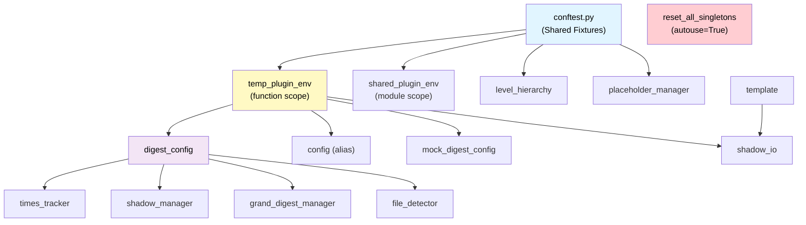

# EpisodicRAG Testing Guide

テストスイートのガイドドキュメント。

## Table of Contents

- [Quick Start](#quick-start)
- [Test Organization](#test-organization)
- [Test Summary](#test-summary)
- [Fixture Dependency Map](#fixture-dependency-map)
- [Adding New Tests](#adding-new-tests)
- [Test Naming Convention](#test-naming-convention)
- [Debugging Tips](#debugging-tips)
- [Hypothesis Profiles](#hypothesis-profiles)
- [Performance Targets](#performance-targets)
- [CLI Integration Tests](#cli-integration-tests-v400)
- [Continuous Integration](#continuous-integration)
- [Tools Tests](#tools-tests-v410)
- [Known Gaps](#known-gaps)

---

## Quick Start

```bash
# 全テスト実行
pytest scripts/test/ -v

# 単体テストのみ
pytest scripts/test/ -m unit

# 統合テストのみ
pytest scripts/test/ -m integration

# slowマーカー以外（CI用：1秒超のテストを除外）
pytest scripts/test/ -m "not slow"

# fastマーカーのみ（純粋ロジック、I/Oなし）
pytest scripts/test/ -m fast

# Property-based tests のみ
pytest scripts/test/ -m property

# CLI統合テストのみ [v4.0.0+]
pytest scripts/test/cli_integration_tests/ -m cli
```

---
## Test Organization

### Architecture Layers

テストはアプリケーションのアーキテクチャ層に対応して構成されています：

```
test/
├── conftest.py              # 共通フィクスチャ
├── test_helpers.py          # テストヘルパー
├── test_constants.py        # テスト用定数
├── domain_tests/            # 純粋なビジネスロジック (30 files)
├── config_tests/            # Config層3層化対応 (14 files) [v4.0.0+]
├── application_tests/       # ユースケース (18 files)
│   ├── grand/               # GrandDigest関連
│   ├── shadow/              # Shadow関連（cascade_orchestrator含む）
│   └── finalize/            # Finalize処理
│       └── validators/      # バリデータ
├── infrastructure_tests/    # I/O操作 (11 files)
│   └── config/              # PathValidatorChain [v4.1.0+]
├── interfaces_tests/        # エントリポイント (22 files)
│   └── provisional/         # Provisional処理
├── integration_tests/       # E2Eシナリオ (14 files)
├── cli_integration_tests/   # CLI E2E (4 files) [v4.0.0+]
├── performance_tests/       # ベンチマーク (1 file)
└── tools_tests/             # 開発ツール (2 files) [v4.1.0+]
```

---

## Test Summary

### 層別テストファイル一覧

| 層 | 主なテストファイル | ファイル数 |
|----|-------------------|-----------|
| **Domain** | `test_validators.py`, `test_file_naming.py`, `test_level_registry.py`, `test_formatter_registry.py`, `test_types_imports.py`, `test_level_literals.py` | 30 |
| **Config** | `test_config.py`, `test_path_resolver.py`, `test_threshold_provider.py`, `test_config_builder.py` | 14 |
| **Infrastructure** | `test_json_repository.py`, `test_file_scanner.py`, `test_logging_config.py`, `test_path_validators.py` | 11 |
| **Application** | `test_shadow_*.py`, `test_grand_digest.py`, `test_cascade_orchestrator.py`, `test_persistence.py` | 18 |
| **Interfaces** | `test_finalize_from_shadow.py`, `test_*_cli_*.py`, `test_setup_*.py`, `test_auto_*.py`, `test_cli_helpers.py` | 22 |
| **Integration** | `test_e2e_workflow.py`, `test_full_cascade.py`, `test_config_integration.py` | 14 |
| **CLI Integration** | `test_digest_*_cli.py`, `test_workflow_cli.py` | 4 |
| **Performance** | `test_benchmarks.py` | 1 |
| **Tools** | `test_check_footer.py`, `test_link_checker.py` | 2 |

> 📊 最新のテスト数: `pytest --collect-only | tail -1`
> 📁 ファイル数確認: `find scripts/test -name "test_*.py" | wc -l`

### カバレッジ目標

| カテゴリ | 目標 | 現状 |
|---------|------|------|
| Domain層 | 90%+ | [Codecov参照](https://codecov.io/gh/Bizuayeu/Plugins-Weave) |
| Application層 | 80%+ | 同上 |
| 全体 | 75%+ | 同上 |

### Test Markers

```python
@pytest.mark.unit          # 純粋ロジック、<100ms、I/Oなし
@pytest.mark.integration   # ファイルI/O、複数コンポーネント
@pytest.mark.slow          # 1秒超（-m "not slow" で除外）
@pytest.mark.fast          # 高速テスト（純粋ロジック、I/Oなし、明示的に指定）
@pytest.mark.property      # Hypothesis property-based tests
@pytest.mark.performance   # ベンチマーク（デフォルトでスキップ）
@pytest.mark.cli           # CLI統合テスト（subprocess経由）[v4.0.0+]
```

> **Note**: `slow` は除外用（`-m "not slow"`）、`fast` は選択用（`-m fast`）として使い分けます。

---

## Fixture Dependency Map



### Core Fixtures

#### `temp_plugin_env` (function scope)

隔離された一時ファイルシステムを提供。

```python
def test_something(temp_plugin_env):
    config = DigestConfig(plugin_root=temp_plugin_env.plugin_root)
    # テスト後に自動クリーンアップ
```

**Properties:**
- `.plugin_root` - Pluginルートディレクトリ
- `.loops_path` - data/Loops ディレクトリ
- `.digests_path` - data/Digests ディレクトリ
- `.essences_path` - data/Essences ディレクトリ
- `.config_dir` - .claude-plugin ディレクトリ

#### `shared_plugin_env` (module scope)

モジュール内で共有される読み取り専用環境。

**注意:** このフィクスチャを使用するテストは環境を変更してはいけません。

#### `sample_loop_files`

5つのサンプルLoopファイルを含む環境を提供。

```python
def test_with_loops(sample_loop_files):
    env, loop_files = sample_loop_files
    assert len(loop_files) == 5
```

### Additional Fixtures [v4.0.0+]

#### `reset_all_singletons` (autouse=True)

テスト間の状態分離を保証する自動実行フィクスチャ。

- `level_registry`: レベル設定のシングルトン
- `file_naming`: ファイル命名用レジストリ参照
- `error_formatter`: エラーフォーマッタのデフォルトインスタンス

#### `mock_digest_config`

パス情報のみを持つ軽量モックDigestConfig。

```python
def test_with_mock(mock_digest_config):
    assert mock_digest_config.plugin_root.exists()
```

#### `level_hierarchy`

SSoT関数からレベル階層情報を取得。

#### `placeholder_manager`

PlaceholderManagerインスタンスを提供。

---
## Adding New Tests

### Unit Tests

```python
@pytest.mark.unit
class TestFileNaming:
    def test_extract_loop_number_valid_format(self):
        result = extract_file_number("L00123_test.txt")
        assert result == ("L", 123)

    @pytest.mark.parametrize("input,expected", [
        ("L00001_test.txt", 1),
        ("L99999_test.txt", 99999),
    ])
    def test_extract_with_various_formats(self, input, expected):
        _, number = extract_file_number(input)
        assert number == expected
```

### Integration Tests

```python
@pytest.mark.integration
@pytest.mark.slow
class TestShadowUpdate:
    def test_update_adds_files_to_shadow(self, temp_plugin_env):
        # Arrange
        config = DigestConfig(plugin_root=temp_plugin_env.plugin_root)
        manager = ShadowGrandDigestManager(config)

        # Act
        manager.update_shadow_for_new_loops()

        # Assert
        shadow_data = manager.get_shadow_digest_for_level("weekly")
        assert shadow_data is not None
```

### Property-Based Tests

```python
@pytest.mark.property
class TestFileNamingInvariants:
    @given(st.integers(min_value=1, max_value=99999))
    @settings(max_examples=500)
    def test_format_extract_roundtrip(self, number):
        """フォーマット→抽出のラウンドトリップ不変条件"""
        formatted = format_digest_number("weekly", number)
        result = extract_file_number(formatted)
        assert result[1] == number
```

---

## Test Naming Convention

- `test_<module>.py` - 単体テスト
- `test_e2e_<scenario>.py` - E2Eワークフローテスト
- `test_<component>_properties.py` - Property-based tests
- `test_concurrent_<aspect>.py` - 並行処理テスト

---

## Debugging Tips

### Running Specific Tests

```bash
# 単一テストクラス
pytest scripts/test/integration_tests/test_e2e_workflow.py::TestE2ELoopDetectionToShadow -v

# 単一テストメソッド
pytest scripts/test/integration_tests/test_e2e_workflow.py::TestE2ELoopDetectionToShadow::test_new_loops_detected -v

# 出力付きで実行
pytest -s --tb=short
```

### Fixture Inspection

```bash
# 利用可能なフィクスチャを表示
pytest --fixtures

# カスタムフィクスチャのみ表示
pytest --fixtures scripts/test/conftest.py
```

---

## Hypothesis Profiles

```python
# デフォルト: 100 examples
settings.register_profile("default", max_examples=100)

# CI用: 500 examples
settings.register_profile("ci", max_examples=500, verbosity=Verbosity.verbose)

# 高速チェック: 20 examples
settings.register_profile("quick", max_examples=20)
```

使用方法:
```bash
HYPOTHESIS_PROFILE=ci pytest scripts/test/ -m property
```

---

## Performance Targets

- Unit test suite: <5秒
- Integration suite: <30秒
- Full test suite: <2分

---

## CLI Integration Tests [v4.0.0+]

v4.0.0で追加されたCLI E2Eテストフレームワーク。subprocess経由で実際のCLIコマンドを実行してテストします。

### ディレクトリ構成

```
cli_integration_tests/
├── __init__.py
├── conftest.py              # CLI専用フィクスチャ
├── cli_runner.py            # CLIRunner ヘルパークラス
├── test_digest_setup_cli.py
├── test_digest_config_cli.py
├── test_digest_auto_cli.py
└── test_workflow_cli.py     # ワークフロー統合テスト [v4.1.0+]
```

### CLIRunner

subprocess経由でCLIコマンドを実行するヘルパークラス:

```python
@pytest.mark.cli
def test_setup_check(cli_runner):
    result = cli_runner.run_digest_setup("check")
    result.assert_success()
    result.assert_json_status("not_configured")
```

### CLI専用フィクスチャ

| フィクスチャ | 説明 |
|-------------|------|
| `cli_temp_dir` | 一時ディレクトリ |
| `cli_plugin_root` | 最小構造のプラグインルート |
| `cli_runner` | CLIRunner インスタンス |
| `configured_cli_env` | 設定済み環境（config.json、テンプレート等） |
| `configured_cli_runner` | 設定済み環境のCLIRunner |

### 実行方法

```bash
# CLI統合テストのみ実行
pytest scripts/test/cli_integration_tests/ -m cli -v

# 特定のCLIテストのみ
pytest scripts/test/cli_integration_tests/test_digest_setup_cli.py -v
```

---

## Continuous Integration

### GitHub Actions

[](https://github.com/Bizuayeu/Plugins-Weave/actions/workflows/test.yml)
[](https://codecov.io/gh/Bizuayeu/Plugins-Weave)

- **テスト実行**: PR作成時・mainマージ時に自動実行
- **カバレッジレポート**: [Codecov Dashboard](https://codecov.io/gh/Bizuayeu/Plugins-Weave)

### ローカル実行

```bash
# 最小テストセット（PR用）
pytest scripts/test/ -m "not performance" --tb=short

# フルテストセット（マージ後）
pytest scripts/test/ -v

# カバレッジ付き
pytest scripts/test/ --cov=. --cov-report=term-missing --cov-report=html

# HTMLレポート確認
open htmlcov/index.html  # macOS
start htmlcov/index.html # Windows
```

---

## Tools Tests [v4.1.0+]

開発支援ツールのテスト。

```
tools_tests/
├── test_check_footer.py     # Digestフッター検証
└── test_link_checker.py     # ドキュメントリンクチェック
```

---

## Known Gaps

### 将来の改善候補

1. **8レベル完全カスケードテスト** - 現在はWeekly→Monthlyの2レベルまで

> **Note**: 以下は実装済み
> - エラー回復テスト → `test_stateful_workflow.py::ErrorRecoveryStateMachine`
> - 境界条件テスト → `test_threshold_boundaries.py`
> - 並行アクセステスト → `test_concurrent_access.py`

---
**EpisodicRAG** by Weave | [GitHub](https://github.com/Bizuayeu/Plugins-Weave)
