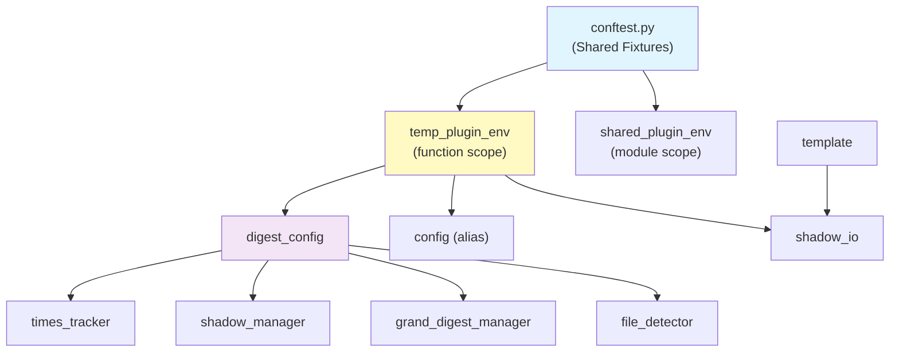

# EpisodicRAG Testing Guide

テストスイートのガイドドキュメント。

## Quick Start

```bash
# 全テスト実行
pytest scripts/test/ -v

# 単体テストのみ
pytest scripts/test/ -m unit

# 統合テストのみ
pytest scripts/test/ -m integration

# 高速テストのみ（CIで使用）
pytest scripts/test/ -m "not slow"

# Property-based tests のみ
pytest scripts/test/ -m property
```

## Test Organization

### Architecture Layers

テストはアプリケーションのアーキテクチャ層に対応して構成されています：

```
test/
├── domain_tests/           # 純粋なビジネスロジック（I/Oなし）
├── config_tests/           # 設定管理
├── application_tests/      # ユースケース
│   ├── grand/              # GrandDigest関連
│   └── shadow/             # Shadow関連
├── infrastructure_tests/   # I/O操作
├── interfaces_tests/       # エントリポイント
├── integration_tests/      # E2Eシナリオ
└── performance_tests/      # ベンチマーク
```

### Test Markers

```python
@pytest.mark.unit          # 純粋ロジック、<100ms、I/Oなし
@pytest.mark.integration   # ファイルI/O、複数コンポーネント
@pytest.mark.slow          # 1秒超
@pytest.mark.property      # Hypothesis property-based tests
@pytest.mark.performance   # ベンチマーク（デフォルトでスキップ）
```

## Fixture Dependency Map



### Core Fixtures

#### `temp_plugin_env` (function scope)

隔離された一時ファイルシステムを提供。

```python
def test_something(temp_plugin_env):
    config = DigestConfig(plugin_root=temp_plugin_env.plugin_root)
    # テスト後に自動クリーンアップ
```

**Properties:**
- `.plugin_root` - Pluginルートディレクトリ
- `.loops_path` - data/Loops ディレクトリ
- `.digests_path` - data/Digests ディレクトリ
- `.essences_path` - data/Essences ディレクトリ
- `.config_dir` - .claude-plugin ディレクトリ

#### `shared_plugin_env` (module scope)

モジュール内で共有される読み取り専用環境。

**注意:** このフィクスチャを使用するテストは環境を変更してはいけません。

#### `sample_loop_files`

5つのサンプルLoopファイルを含む環境を提供。

```python
def test_with_loops(sample_loop_files):
    env, loop_files = sample_loop_files
    assert len(loop_files) == 5
```

## Adding New Tests

### Unit Tests

```python
@pytest.mark.unit
class TestFileNaming:
    def test_extract_loop_number_valid_format(self):
        result = extract_file_number("L00123_test.txt")
        assert result == ("L", 123)

    @pytest.mark.parametrize("input,expected", [
        ("L00001_test.txt", 1),
        ("L99999_test.txt", 99999),
    ])
    def test_extract_with_various_formats(self, input, expected):
        _, number = extract_file_number(input)
        assert number == expected
```

### Integration Tests

```python
@pytest.mark.integration
@pytest.mark.slow
class TestShadowUpdate:
    def test_update_adds_files_to_shadow(self, temp_plugin_env):
        # Arrange
        config = DigestConfig(plugin_root=temp_plugin_env.plugin_root)
        manager = ShadowGrandDigestManager(config)

        # Act
        manager.update_shadow_for_new_loops()

        # Assert
        shadow_data = manager.get_shadow_digest_for_level("weekly")
        assert shadow_data is not None
```

### Property-Based Tests

```python
@pytest.mark.property
class TestFileNamingInvariants:
    @given(st.integers(min_value=1, max_value=99999))
    @settings(max_examples=500)
    def test_format_extract_roundtrip(self, number):
        """フォーマット→抽出のラウンドトリップ不変条件"""
        formatted = format_digest_number("weekly", number)
        result = extract_file_number(formatted)
        assert result[1] == number
```

## Test Naming Convention

- `test_<module>.py` - 単体テスト
- `test_e2e_<scenario>.py` - E2Eワークフローテスト
- `test_<component>_properties.py` - Property-based tests
- `test_concurrent_<aspect>.py` - 並行処理テスト

## Debugging Tips

### Running Specific Tests

```bash
# 単一テストクラス
pytest scripts/test/integration_tests/test_e2e_workflow.py::TestE2ELoopDetectionToShadow -v

# 単一テストメソッド
pytest scripts/test/integration_tests/test_e2e_workflow.py::TestE2ELoopDetectionToShadow::test_new_loops_detected -v

# 出力付きで実行
pytest -s --tb=short
```

### Fixture Inspection

```bash
# 利用可能なフィクスチャを表示
pytest --fixtures

# カスタムフィクスチャのみ表示
pytest --fixtures scripts/test/conftest.py
```

## Hypothesis Profiles

```python
# デフォルト: 100 examples
settings.register_profile("default", max_examples=100)

# CI用: 500 examples
settings.register_profile("ci", max_examples=500, verbosity=Verbosity.verbose)

# 高速チェック: 20 examples
settings.register_profile("quick", max_examples=20)
```

使用方法:
```bash
HYPOTHESIS_PROFILE=ci pytest scripts/test/ -m property
```

## Performance Targets

- Unit test suite: <5秒
- Integration suite: <30秒
- Full test suite: <2分

## Known Gaps

### 将来の改善候補

1. **8レベル完全カスケードテスト** - 現在は2レベルまでのテスト
2. **エラー回復テスト** - 破損ファイルからの回復シナリオ
3. **境界条件テスト** - 閾値ちょうどのケース
4. **並行書き込みテスト** - 読み取り中の書き込みシナリオ

## Continuous Integration

```bash
# 最小テストセット（PR用）
pytest scripts/test/ -m "not performance" --tb=short

# フルテストセット（マージ後）
pytest scripts/test/ -v
```
